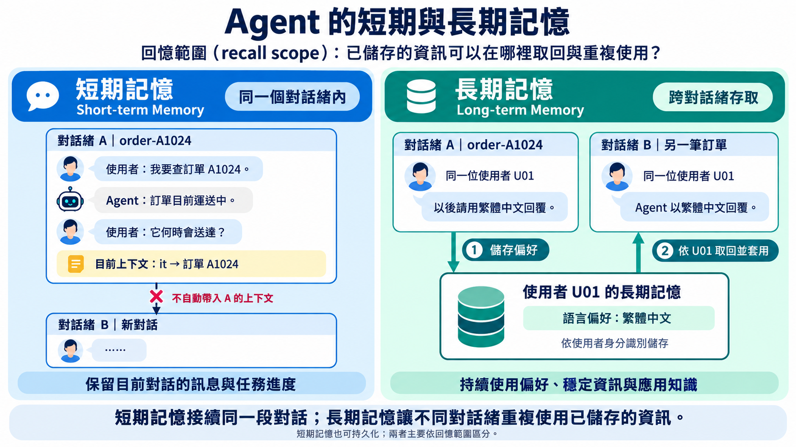
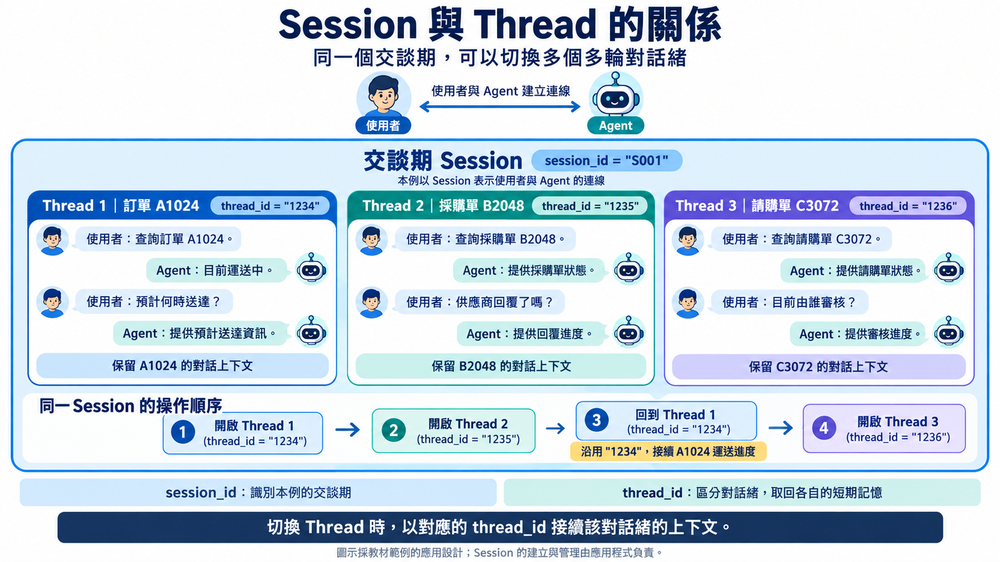

# Agent 的短期記憶（Short-term Memory）

## 簡介

### 記憶對 Agent 的重要性

記憶是一種保存過往互動資訊的系統。

記憶讓 Agent 能夠記住過往互動、從回饋中學習，並配合使用者偏好調整回應。

當 Agent 處理更複雜、需要多次與使用者互動的任務時，這項能力對效率與使用者滿意度都十分重要。

記憶能力讓使 Agent 成為**有狀態系統（stateful system）**，能持續保留上下文（context），並隨著互動提供更個人化且切合需求的回應。

### 短期記憶（Short-term Memory）與長期記憶（Long-term Memory）

Agent 的記憶可以依照**回憶範圍（recall scope）**分類，也就是已儲存的資訊可以在哪些範圍內被取回及重複使用。

#### 短期記憶

短期記憶保留進行中對話的上下文

它讓 Agent 能理解: 後續問題、參考先前的訊息，並接續尚未完成的任務，無須使用者重複提供相同資訊。

例如，以下是使用者與客服 Agent 的對話：

```
User: I want to check order A1024.
Agent: Order A1024 is currently in transit.
User: When will it arrive?
```

要回答第二個問題， Agent 必須記住 *it* 指的是訂單`A1024`。
- 這項資訊屬於目前的對話，而非使用者的永久個人資料。

短期記憶通常儲存在電腦的隨機存取記憶體（RAM）中，不會持久化（persist）至磁碟。

#### 長期記憶

長期記憶儲存需要在不同對話緒(threads)之間持續使用的資訊。常見例子包括：

- 使用者的姓名、語言或回覆格式偏好；
- 已知且穩定的客戶資訊，例如偏好的配送方式；
- 日後需要重複使用的應用程式層級知識或指示。

假設客戶告訴 Agent ：「以後請用繁體中文回覆。」

如果這項偏好只儲存在**對話緒（thread）**`order-A1024` 中的短期記憶，新的對話緒就無法存取。
- 因為短期記憶只在同一個對話緒中有效。

若將它作為長期記憶，儲存在該客戶的身分識別之下， Agent 就能在另一個對話緒中取回並套用這項偏好。

長期記憶通常會持久化至磁碟或資料庫（database），以便跨對話緒取回。

長期記憶要記住的資訊通常是**穩定且不會經常變動**的事實或偏好:
- 應用程式應決定哪些資訊值得記住、如何更新，以及何時取回。
- 只儲存相關的事實與偏好，有助於避免過時或無關的資訊進入模型的上下文。

不應儲存所有對話的完整逐字紀錄。

#### 比較

| 面向 | 短期記憶 | 長期記憶 |
|---|---|---|
| 回憶範圍 | 單一對話緒 | 跨對話緒 |
| 典型內容 | 訊息歷史（message history）與目前的任務狀態（state） | 使用者偏好、穩定的事實、共用知識 |
| 主要用途 | 延續多輪對話（multi-turn conversation） | 在未來的對話緒中提供個人化回應或重複使用知識 |

參考資料：

- [記憶概觀](https://docs.langchain.com/oss/python/concepts/memory)
- [短期記憶](https://docs.langchain.com/oss/python/langchain/short-term-memory)
- [長期記憶](https://docs.langchain.com/oss/python/langchain/long-term-memory)



##  Agent 的短期記憶

### 短期記憶運作方式

Agent 的短期記憶就是訊息歷史(message history)

訊息歷史記錄了 Agent 、使用者、工具（tools）之間的訊息互動。

Agent 會自動維護此訊息歷史，並在每次呼叫大型語言模型（LLM）時將其作為提示（prompt）的一部分傳入。

### 短期記憶的檢查點儲存器（checkpointer）

在 LangChain 中，檢查點儲存器(checkpointer)會在每一次 Agent 狀態改變時，為訊息歷史建立快照（snapshot），並存入指定的儲存區。

「狀態改變」指訊息歷史有新的訊息被加入，例如：
- 使用者發送訊息給 Agent 的 `HumanMessage`
- Agent 回覆使用者訊息的 `AIMessage` 
-  Agent 呼叫工具並收到 `ToolMessage`

記憶儲存區可以是：
- 電腦的記憶體
- 資料庫或其它實體儲存系統

### 同一交談期(Session)下的多輪對話緒(multi-turn conversation threads)

當使用者連線到 Agent 時，會建立一個交談期(session), 代表使用者與 Agent 之間的連線，有維一的 session_id。

在同一個交談期下，使用者可以與 Agent 進行多個多輪對話緒(multi-turn conversation threads)，每個對話緒都有一個唯一的識別碼(thread_id)。

例如：
- 使用者與 Agent 建立連線。
- 使用者查詢訂單 A1024 的狀態，並與 Agent 進行多輪對話
- 之後，使用者在同個連線，開啟另一個多輪對話緒，查詢採購單 B2048 的狀態，並與 Agent 進行多輪對話
- 接著，使用者回到第一個多輪對話緒(仍在同個 Session)，繼續對話，查詢訂單 A1024 的運送進度
- 再之後，使用者開啟第三個多輪對話緒，查詢請購單 C3072 的狀態，並與 Agent 進行多輪對話

所以，在此交談期下總共有三個多輪對話緒：

```
Session
 |-- Thread 1: 訂單 A1024
 |-- Thread 2: 採購單 B2048
 |-- Thread 3: 請購單 C3072
```

### LangChain 短期記憶管理多個對話緒的方式

每一個多輪對話緒都有一個唯一的識別碼`thread_id`，用來區分不同的對話緒。

 Agent 使用此`thread_id` 來管理不同的多輪對話緒。

所以，上述的三個多輪對話緒可以表示為：

```
Session
    |-- Thread 1: 訂單 A1024 (thread_id = "1234")
    |-- Thread 2: 採購單 B2048 (thread_id = "1235")
    |-- Thread 3: 請購單 C3072 (thread_id = "1236")
```



### 檢查點儲存器的運作流程

呼叫 Agent 時，透過`config` 傳入一個`thread_id`，來指定這次呼叫所屬的多輪對話緒。

當 Agent 收到一個新的使用者訊息（user message）時，檢查點儲存器的運作流程如下：

1. **辨識對話緒**：根據`thread_id` 判斷這次訊息屬於哪一段對話。
2. **載入檢查點（checkpoint）**：從短期記憶中，檢查點儲存器讀取該對話緒最新的狀態快照（state snapshot）。
3. **取得狀態**： Agent 取得先前的訊息歷史與其他狀態資料。
4. **執行下一步**：新的使用者訊息被加入狀態， Agent 再呼叫模型或工具。
5. **建立新檢查點**：步驟完成後，保存更新的狀態，成為下一次執行的起點。

此流程讓每一次 Agent 呼叫（Agent invocation）不再是互不相關的單輪請求。只要使用相同的
`thread_id`， Agent 就能從先前保存的狀態繼續對話；若改用新的`thread_id`，
則會開始一段狀態彼此獨立的新對話。

> 一個 `thread_id` 可取出一個快照集合(collection of checkpoints)
> 一個快照(snapshot) 就是某個時刻的 Agent 狀態（state）


參考資料：
- [檢查點儲存器：LangChain 文件](https://docs.langchain.com/oss/python/langgraph/checkpointers?_gl=1*em85qg*_gcl_au*MTUxMzgyNzc4Mi4xNzgzNjk3MDYy*_ga*MTE0ODYzNjc0MC4xNzc0NTczMDU3*_ga_47WX3HKKY2*czE3ODU0MjE2MzQkbzMyJGcxJHQxNzg1NDIxNzYwJGo5JGwwJGgw)

Q: 下個問題，要如何對 Agent 狀態做快照（snapshot）與回復（restore）呢？
A: LangChain 已幫開發者準備好可直接使用的物件了 -- `InMemorySaver`

## `InMemorySaver` 物件

### `InMemorySaver` 物件

`InMemorySaver` 是 LangGraph 提供的一種 checkpointer。它將各個 thread 的 checkpoints 儲存在記憶體中，適合用來學習、開發及測試。

要使 Agent 具有短期記憶，需要完成兩件事：

1. 建立`InMemorySaver` 物件，並用 Agent 的 `checkpointer` 參數傳入給 Agent 。
2. 每次呼叫 Agent 的 `invoke()` 時，透過`config` 傳入`thread_id`。

### RunnableConfig 物件

傳入 `invoke()` 的 `config` 是一個 [`RunnableConfig` 物件](https://reference.langchain.com/python/langchain-core/runnables/config/RunnableConfig)。

`RunnableConfig` 本身是一個`TypedDict`，可直接用字典（dict）表示，例如：

```python
config = {
    "configurable": {
        "thread_id": "a1024"
    }
}
```

當然也可以使用其建構函數建立`RunnableConfig` 物件
(這種寫法比較易讀，但寫起來比較冗長。):

```python
from langchain_core.runnables.config import RunnableConfig

runnable_config = RunnableConfig(
    configurable={
        "thread_id": "a1024"
    }
)
```


### 程式撰寫樣板

#### 建立具有短期記憶的 Agent

建立具有短期記憶的 Agent 的程式撰寫樣板如下：

```python
from langchain.agents import create_agent
from langgraph.checkpoint.memory import InMemorySaver

# 建立 InMemorySaver 物件
checkpointer = InMemorySaver()

# 建立 Agent
agent = create_agent(
    model=model_name,
    tools=tools,
    system_prompt=system_prompt,
    # 要傳入 checkpointer 實體
    checkpointer=checkpointer
)
```

#### 對特定對話緒(thread)呼叫 Agent

呼叫 Agent 的`invoke()` 時，指定`thread_id` 的程式撰寫樣板如下：

```python
# 使用 `configurable` 欄位指定 Agent 的設定
# 使用 `thread_id` 欄位指定這次呼叫所屬的多輪對話緒(thread)
thread_config = {
    "configurable": {
        "thread_id": "a1024"
    }
}

# 呼叫 Agent 的 invoke()，傳入 user message 與 thread_config
response = agent.invoke(
    state_object,
    config=thread_config
)

```

#### 取得最近一次的回覆訊息

`state_object`，如同先前所述，是一個包含`messages` 欄位的字典，裡面包含這次呼叫的使用者訊息。

```python
{
    "messages": [
        {
            "role": "user",
            "content": "我的訂單 A1024 現在送到哪裡了？"
        }
    ]
}
```

從 `messages` 中的最後一個元素取得 Agent 回覆的訊息：

```python
print(response["messages"][-1].content)
```

## 範例: 建立具有短期記憶的電商客服 Agent 

以下範例延續前一章定義的`get_order_status` 工具、`system_prompt` 與
`model_name`。

原本的 Agent 只需加入`checkpointer`：

```python
from langchain.agents import create_agent
from langgraph.checkpoint.memory import InMemorySaver

# 將 checkpoint 儲存在目前 Python 程序的記憶體中
checkpointer = InMemorySaver()

tools = [get_order_status]

agent = create_agent(
    model=model_name,
    tools=tools,
    system_prompt=system_prompt,
    checkpointer=checkpointer
)
```

`InMemorySaver()` 建立一個儲存檢查點的物, 將它傳給
`create_agent()` 的`checkpointer` 參數.

Agent 會在執行過程中保存
訊息歷史，包括使用者訊息、AI 訊息（AI message）、工具呼叫（tool call）與工具結果（tool result）。

### 在同個對話緒中使用短期記憶

先替查詢訂單`A1024` 的對話指定一個`thread_id`：

```python
thread_config = {
    "configurable": {
        "thread_id": "a1024"
    }
}
```

第一次呼叫 Agent 時，使用者明確提供訂單編號：

```python
response = agent.invoke(
    {
        "messages": [
            {
                "role": "user",
                "content": "我的訂單 A1024 現在送到哪裡了？"
            }
        ]
    },
    config=thread_config
)

print(response["messages"][-1].content)
```

 Agent 會呼叫`get_order_status` 工具，並將這次互動產生的訊息歷史
保存到`thread_id="a1024"` 的檢查點。

接著，使用者不再重複訂單編號，只詢問：

```python
response = agent.invoke(
    {
        "messages": [
            {
                "role": "user",
                "content": "什麼時候會到？"
            }
        ]
    },
    config=thread_config
)

print(response["messages"][-1].content)
```

第二次呼叫仍使用相同的`thread_config`。因此，檢查點儲存器會先載入
`thread_id="a1024"` 的最新檢查點， Agent 便能從先前的訊息歷史
得知使用者詢問的是訂單`A1024`，不需要使用者再提供一次訂單編號。

請注意，每次`invoke()` 只傳入這一輪新增的使用者訊息。先前的
訊息歷史已由檢查點儲存器保存，不需要由應用程式再次傳入。

如果改用不同的`thread_id`， Agent 會視為另一段獨立對話，也就無法從
新的對話緒得知「什麼時候會到？」指的是哪一張訂單。

`InMemorySaver` 的資料只存在目前 Python 程序的記憶體中；程序結束後，
檢查點也會消失。正式環境若需要在程式重啟後恢復對話，應改用以資料庫為儲存後端且具備
持久化能力的檢查點儲存器（database-backed checkpointer）。

參考資料：

- [短期記憶：LangChain 文件](https://docs.langchain.com/oss/python/langchain/short-term-memory)
