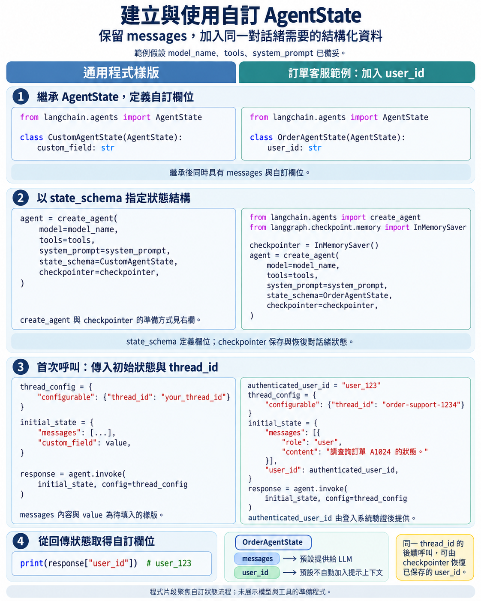
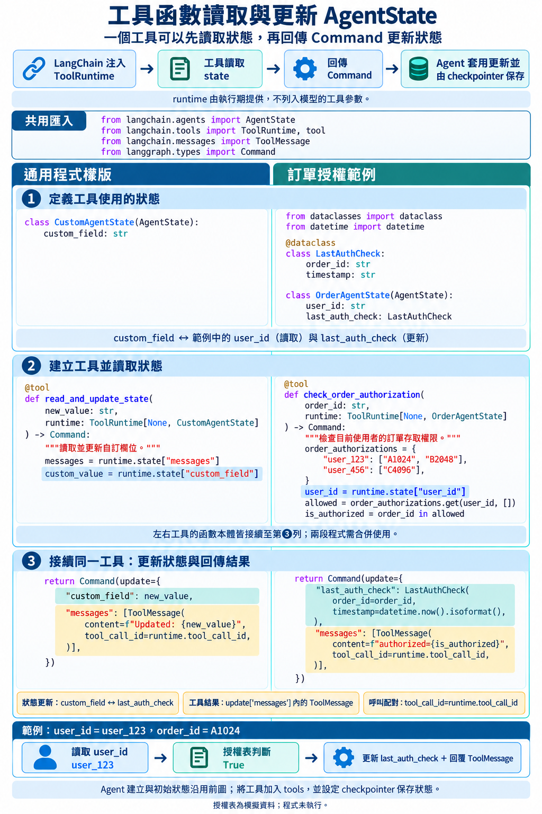
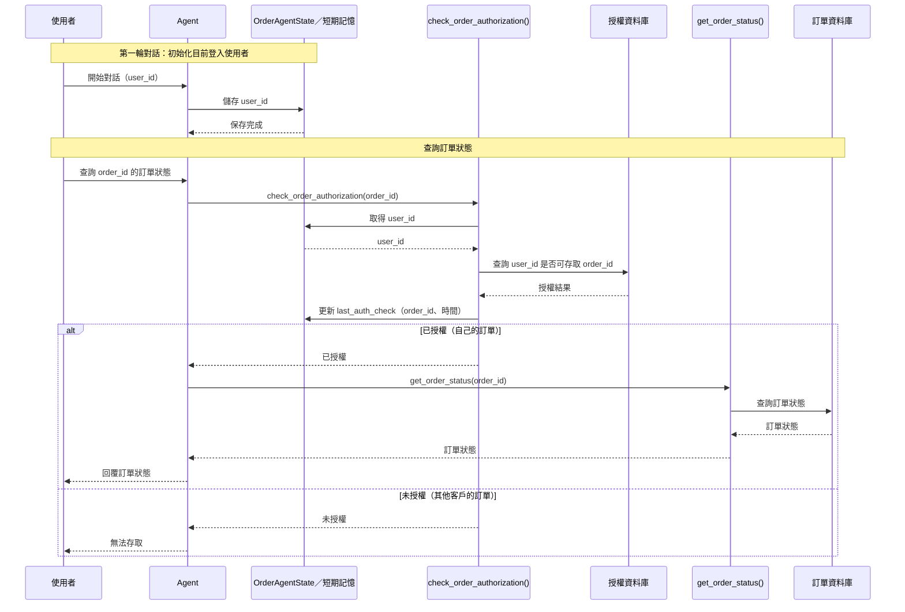

# 自訂 Memory 結構 與 Agent 行為動態

## 自訂 Agent 記憶

### 建立自訂的 AgentState 結構

預設的 [`AgentState`](https://reference.langchain.com/python/langchain/agents/middleware/types/AgentState) 使用`messages` 欄位保存 Agent 的訊息歷史。

如果 Agent 還需要在同一個對話緒中保存其它結構化資料，可以繼承
`AgentState`，加入自訂欄位。

樣版如下:

```py
class CustomAgentState(AgentState):
    # your custom fields here
    ...
```

此類別同時會具有 `messages` 欄位及自訂欄位。

特別注意:
> `messages` 會自動被加入到提示上下文（prompt context）中，並可被 LLM 模型讀取。
> 但自訂欄位不會，需要特別處理。

### 範例: 建立自訂 AgentState，加入登入者的 user_id 欄位

在電商客服情境中，我們想要加入權限控制的檢查，限制只能查詢自己的訂單。

系統需要知道目前登入者的 `user_id`，才能確認是否有權限查看這張訂單

因此，本例在 Agent 狀態中加入`user_id`：

```python
from langchain.agents import AgentState

class OrderAgentState(AgentState):
    # 目前登入者的識別碼
    user_id: str
```

`OrderAgentState` 保留原本的`messages` 欄位，並增加`user_id` 欄位：

```text
OrderAgentState
 |-- messages # LLM 模型可見
 |-- user_id # LLM 模型不可見(預設)
```

### 建立 Agent 時，使用自訂的 AgentState

建立 Agent 時，透過`state_schema` 參數指定自訂的`AgentState` 類別。


```python
agent = create_agent(
    model=model_name,
    tools=tools,
    system_prompt=system_prompt,
    checkpointer=checkpointer,      # 使用 InMemorySaver 儲存 short-term memory
    state_schema=OrderAgentState,  # 使用自訂的 AgentState
)
```

### 第一次呼叫 Agent 時初始化自訂欄位

第一次呼叫 Agent 時要初始化 Agent 的 State，除了 `messages` 欄位外，還包括自訂欄位。

initial state 的寫法：

```python
initial_state = {
    "messages": [...],
    "custom_field_1": value1,
    "custom_field_2": value2,
    ...
}
```

除此外，還要傳入 `thread_id`，

完成的程式樣版如下：

```python
thread_config = {
    "configurable": {
        "thread_id": "your_thread_id"
    }
}

initial_state = {
    "messages": [...],
    "custom_field_1": value1,
    "custom_field_2": value2,
    ...
}

response = agent.invoke(
    initial_state,
    config=thread_config
)
```

### Response 中的 AgentState

Response 回傳的結構即是自訂的 AgentState，包含`messages` 與自訂欄位。

```py
{'messages': [...],
 'customer_field_1': 'value_of_user_id',}
```


### 範例：登入後建立初始狀態（設定記憶中的自訂欄位）

本例假設登入系統已經完成帳號驗證，並將可信任的`user_id` 交給應用程式。
(登入、密碼及權杖（token）的驗證流程不在本節討論範圍內。)

```python
# 假設這是登入系統完成驗證後回傳的結果
authenticated_user_id = "user_123"

initial_state = {
    # LLM 可見
    "messages": [
        {
            "role": "user",
            "content": "請查詢訂單 A1024 的狀態。"
        }
    ],
    # LLM 不可見
    "user_id": authenticated_user_id
}
```

於第一輪對話時，初始化 Agent 狀態，含`user_id` 欄位。

```python
thread_config = {
    "configurable": {
        "thread_id": "order-support-1234"
    }
}

agent.invoke(
    initial_state,
    config=thread_config
)
```

第一次呼叫 Agent 時，應用程式將`initial_state` 傳給 Agent 。

因為 Agent 使用 `OrderAgentState` 與檢查點儲存器，所以`messages` 和`user_id` 都會成為
短期記憶的一部分，並保存到這個 `thread_id` 下的快照點。

查看回應中的 AgentState 的自訂欄位：

```python
print(response["user_id"])  # 輸出: user_123
```

### 複習圖卡



### LLM 是否可直接讀取自訂的 AgentState 欄位？

預設情況下，大型語言模型只會讀取訊息清單(messages)。

除非將自訂欄位手動注入提示上下文（prompt context），否則模型不會自動讀取或解讀這些鍵值。

所以，我們沒有辦法在呼叫 Agent 時，用人類訊息（Human Message）去要求 LLM 直接讀取自訂欄位 (如 `user_id`)。

有兩種方式可以讓 LLM 讀取自訂的 `AgentState` 欄位：

1. 使用`ToolRuntime`，將於下一節說明。
2. 使用 [`AgentMiddleware`](https://reference.langchain.com/python/langchain/agents/middleware/types/AgentMiddleware) 攔截 Agent 狀態，將自訂欄位注入到提示上下文中，讓 LLM 可見。
   - 當使用`create_agent` 建立 Agent 時，使用此方式。

參考資料：

- [自訂 Agent 記憶：LangChain 文件](https://docs.langchain.com/oss/python/langchain/short-term-memory#customizing-agent-memory)
- [中介軟體（Middleware）概觀：LangChain 文件](https://docs.langchain.com/oss/python/langchain/middleware/overview)

## 使用工具讀、寫短期記憶

### 讀取 Agent 記憶 - 使用 ToolRuntime

Agent 執行工具時，LangChain 會自動注入一個 `ToolRuntime` 物件給工具函數。
- 它提供 Agent 目前的狀態，包括定義於`AgentState` 中的所有自訂欄位。
- 使用`ToolRuntime` 物件的`state` 屬性，可以在工具中讀取 Agent 的記憶。

工具函數只要在函數定義中加入`runtime: ToolRuntime` 參數，LangChain 就會在執行期自動注入`ToolRuntime` 物件。

### ToolRuntime 的泛型類別

如何知道 `ToolRuntime` 中的 `state` 的型別？

`ToolRuntime` 被設計成泛型類別（generic class）：
- 在定義工具函數時再指定 `ToolRuntime` 的型別參數，告訴工具函數 AgentState 的結構。


`ToolRuntime[ContextT, StateT]` 使用時可指定兩個型別參數：

- `ContextT`:  Agent 執行過程中的執行環境（Execution Context）的自訂資料結構，不會隨交談改變，
  - 例如： API 金鑰（API key）、資料庫連線字串、系統設定等。
  - 如果不需要使用 ContextT，可以指定為`None`。
- `StateT`: AgentState 的自訂資料結構，會隨交談改變，並由檢查點儲存器保存到短期記憶。

如果沒有自訂的執行環境(context)，典型的使用自訂 StateT 樣版如下：

```python
from langchain.tools import ToolRuntime, tool

# Define a custom AgentState class
class CustomAgentState(AgentState):
    custom_field: str

@tool
def your_function(
    arg1: str,
    arg2: int,
    # 在第二個型別參數指定自訂的 AgentState 類別
    runtime: ToolRuntime[None, CustomAgentState]
) :
    """
    Your tool function description.

    Args:
        arg1: Description of the first argument.
        arg2: Description of the second argument.
        runtime: The ToolRuntime object injected by LangChain.

    Returns:
        A dictionary containing the result of the tool function.
    """

    # 從 Agent 的 custom state 讀取目前登入者
    # 取得 messages 欄位 (AgentState 的標準欄位)
    messages = runtime.state["messages"]
    # 取得 custom_field 欄位 (CustomAgentState 的自訂欄位)
    custom_value = runtime.state["custom_field"]

    # 其它操作
    ...

    return "your_results"
```

### 使用工具更新 Agent 記憶

開發者不能直接修改 Agent 的短期記憶，因為 Agent 記憶由檢查點儲存器管理。

要修改 Agent 的記憶，工具必須「命令」檢查點儲存器更新 Agent 狀態。

在工具中回傳`Command` 物件給 Agent 要求更新 Agent 記憶，

在`Command` 物件中使用`update` 欄位指定要更新的欄位與新值

#### 回傳命令更新短期記憶的工具函數 

回傳命令的工具的程式樣版如下：

```python
from langchain.tools import ToolRuntime, tool
from langgraph.types import Command

@tool
def your_tool_function(
    runtime: ToolRuntime[None, CustomAgentState],
    custom_field_to_update: str) -> Command:
    """
    Update the agent's state with a new value.

    Args:
        runtime: The ToolRuntime object injected by LangChain.
        custom_field_to_update: The new value to update the custom field in the agent's state.

    Returns:
        A Command object indicating the state update.
    """

    # do something with custom_field
    ...

    # 回傳 Command 物件，告訴 Agent 要更新 state
    return Command(
        update={
            # Update the custom state field with the new value
            "custom_field_to_update": new_value  # 更新 custom_field 欄位
        }
    )
```

注意，此工具函數只有更新 短期記憶，沒有回傳 `ToolMessage` 給 Agent。

#### 回傳命令更新短期記憶並回傳 ToolMessage 的工具函數

一般執行工具時，會自動產生 ToolMessage， LangChain 會將工具的回傳值放入 ToolMessage 的 content 欄位，並將其加入 Agent 的訊息歷史。

但如果工具回傳的是`Command` 物件，此時就必須手動新增一個 ToolMessage 至 Command 的`messages` 欄位。

手動回傳的 ToolMessage 必須包含兩個欄位：
- content: 工具回傳的訊息內容
- tool_call_id: 對應到先前產生的工具呼叫請求（tool call request）的唯一識別碼，LangChain 會將這個 ToolMessage 與先前的工具呼叫請求配對。
  - 使用`runtime.tool_call_id` 取得目前的工具的 tool_call_id。

典型的回傳命令並回傳 ToolMessage 的工具函數樣版如下：

```python

from langchain.tools import ToolRuntime, tool
from langgraph.types import Command, ToolMessage

@tool
def update_agent_state(
    runtime: ToolRuntime[None, CustomAgentState],
    custom_field: str) -> Command:
    """
    function doc string
    """

    # do something with custom_field

    # 回傳 Command 物件，告訴 Agent 要更新 state
    return Command(
        update={
            # Update the custom state field with the new value
            "custom_field": custom_value  # 更新 custom_field 欄位
        },
        # 手動新增一個 ToolMessage 至 command 的 messages 欄位
        "messages": [
            ToolMessage(
                content=f"Updated custom_field to {new_value}",
                # 一定要有 tool_call_id，才能將這個 ToolMessage 與先前的工具呼叫請求配對
                tool_call_id=runtime.tool_call_id
            )
        ]
    )
```

參考資料：
- [工具：LangChain 文件](https://docs.langchain.com/oss/javascript/langchain/tools)
- [ToolRuntime | langgraph.prebuilt](https://reference.langchain.com/python/langgraph.prebuilt/tool_node/ToolRuntime)
  



## 實務範例：訂單狀態查詢與授權檢查

### 商業情境

在客戶關係管理（CRM）聊天機器人（Chatbot）的情境中，允許客戶查詢自己的訂單狀態，但不允許查詢其他客戶的訂單。
所以要在聊天機器人中加入授權檢查的機制。

如果是自己的訂單，聊天機器人會查詢訂單狀態並回覆；
如果是其他客戶的訂單，聊天機器人會拒絕查詢並回覆「無法存取」。

執行授權檢查時，需要知道目前登入使用者的`user_id`。
如此，才能使用`user_id` 與`order_id` 查詢授權資料，判斷該使用者是否有權限查詢指定的訂單。

### 系統邊界與責任分工

將訂單狀態查詢與授權檢查分開，並由不同的工具負責各自的責任。

工具函數：

- `get_order_status()` 只根據`order_id` 查詢訂單狀態。

  - `check_order_authorization()` 從自訂狀態（custom state）取得`user_id`，再判斷該使用者
  是否有權限查看指定的`order_id`。
- 此工具回傳檢查結果，並更新 Agent 狀態中的`last_auth_check` 欄位，記錄最後一次授權檢查的時間及檢查的`order_id`。

自訂狀態（custom state）:
- 將`user_id` 放在 Agent 的自訂狀態中，並由檢查點儲存器保存到短期記憶。

### 授權檢查及訂單狀態查詢的流程

1. 第一輪對話時，將取得的`user_id` 初始化到 Agent 的自訂狀態中，並保存到短期記憶。
2. 使用者嘗試查詢訂單狀態，提示 Agent 先呼叫`check_order_authorization()`，再決定是否呼叫`get_order_status()`。





### 建立自訂 AgentState

繼承`AgentState`，加入`user_id` 欄位：

```python
from langchain.agents import AgentState
from dataclasses import dataclass

@dataclass
class LastAuthCheck:
    order_id: str
    timestamp: str

class OrderAgentState(AgentState):
    # 目前登入者的識別碼
    user_id: str
    # 記錄最後一次授權檢查的時間及檢查的 order_id 
    # LastAuthCheck data class.
    last_auth_check: LastAuthCheck
```

參考資料： [Write short-term memory from tools: LangChain Docs](https://docs.langchain.com/oss/python/langchain/short-term-memory#write-short-term-memory-from-tools)

### `check_order_authorization()` 的工具函式（Tool Function）

```python

from langchain.tools import ToolRuntime, tool
from langgraph.types import Command
from datetime import datetime
from langchain.messages import ToolMessage

@tool
def check_order_auth(order_id: str, runtime:ToolRuntime) -> Command:
    """
    Check whether the current user is authorized to view an order.

    Args:
        user_id: The user ID of the current user.
        order_id: The order ID provided by the user.
        runtime: The ToolRuntime object injected by LangChain.
    
    Returns:
        Command: 一個 Command 物件，更新 Agent state 中的 last_auth_check 欄位，並回傳授權檢查結果(ToolMessage)。
    """

    # 模擬的授權資料，實際系統應從資料庫或授權服務查詢
    order_authorizations = {
        "user_123": ["A1024", "B2048"],
        "user_456": ["C4096"]
    }
    
    # 從 Agent 的 custom state 讀取目前登入者
    user_id = runtime.state["user_id"]

    # 從獨立的授權表取得該 User 可以查看的訂單編號
    authorized_order_ids = order_authorizations.get(user_id, [])
    is_authorized = order_id in authorized_order_ids

    return Command(
        # 更新 Agent state 中的 last_auth_check 欄位，記錄最後一次授權檢查的時間及檢查的 order_id
        update={
            "last_auth_check": LastAuthCheck(
                order_id=order_id,
                # 轉換成 ISO 格式的時間字串，方便後續查詢與比對
                timestamp=datetime.now().isoformat()
            ), 
            # 手動新增一個 ToolMessage 至 command 的 messages 欄位，記錄授權檢查結果
            "messages": [
                ToolMessage(
                    content=f"{{'order_id': '{order_id}', 'authorized': {is_authorized}}}",
                    tool_call_id=runtime.tool_call_id
                )]
        }
    )
```

### `get_order_status()` 查詢訂單狀態

使用前一章的`get_order_status()`。此函數只接受`order_id`，並從 `orders` 查詢狀態，不讀取 Agent 記憶：

```python
from langchain.tools import tool

@tool
def get_order_status(order_id: str) -> dict:
    """
    Retrieves the status of a customer's order based on the provided order ID.

    Args:
        order_id (str): The unique identifier for the customer's order.
    
    Returns:
        dict: A dictionary containing the order status and estimated delivery date.
    """

    # Mocked order status data for demonstration purposes
    orders = {
        "A1024": {
            "status": "Shipped",
            "estimated_delivery": "2023-07-25"
        },
        "B2048": {
            "status": "Processing",
            "estimated_delivery": "2023-07-30"
        },
        "C4096": {
            "status": "Delivered",
            "estimated_delivery": "2023-07-20"   
        }
    }

    status = orders.get(order_id, {"status": "Order ID not found", "estimated_delivery": None })
    return status
```


### 修改系統提示（system prompt）

要求 Agent 必須先呼叫`check_order_authorization`。只有在工具回傳
`authorized` 時，才可以呼叫`get_order_status`：

```python
authorization_rules = """
Additional authorization rules:
- Before calling `get_order_status`, always call
  `check_order_authorization` with the same order ID.
- Only call `get_order_status` when `check_order_authorization` returns
  `authorized=True`.
- If authorization is denied, do not call `get_order_status`. Tell the user
  that the order cannot be accessed.
"""

# 加入授權規則到原來的 system prompt
authorized_system_prompt = system_prompt + "\n" + authorization_rules
```

這些規則用來規範 Agent 的工具呼叫順序。

正式系統仍應在訂單服務的系統邊界強制執行授權，不要只依賴模型遵循提示。

### 建立使用自訂狀態的 Agent 

建立 Agent 時，需要同時指定：

-`state_schema=OrderAgentState`：告訴 Agent 狀態還包含`user_id`。
-`checkpointer=checkpointer`：保存及恢復自訂狀態。
-`tools=[check_order_authorization, get_order_status]`：分別負責授權檢查與
  訂單狀態查詢。

```python
from langchain.agents import create_agent
from langgraph.checkpoint.memory import InMemorySaver


checkpointer = InMemorySaver()

agent = create_agent(
    model=model_name,
    tools=[check_order_authorization, get_order_status],
    system_prompt=authorized_system_prompt,
    state_schema=OrderAgentState,
    checkpointer=checkpointer
)
```

### 第一次呼叫(初始化 Agent 狀態)：寫入登入者的`user_id`

為這段對話建立一個`thread_id`，再將前面準備的`initial_state` 傳給 Agent ：

```python
thread_config = {
    "configurable": {
        "thread_id": "order-support-1234"
    }
}

initial_state = {
    "messages": [
        {
            "role": "user",
            "content": "請查詢訂單 A1024 的狀態。"
        }
    ],
    "user_id": "user_123"
}

response = agent.invoke(
    initial_state,
    config=thread_config
)
```

這次呼叫會把 `user_id="user_123"` 與訊息歷史一起寫入
`thread_id="order-support-1234"` 的檢查點。


本次呼叫產生的 Tool Call Request：

```
AIMessage [0] tool calls:
[{'name': 'check_order_auth',
  'args': {'order_id': 'A1024'},
  'id': 'call_2z2p5KV3nB1myPCqUXZ0ttLY',
  'type': 'tool_call'}]

AIMessage [1] tool calls:
[{'name': 'get_order_status',
  'args': {'order_id': 'A1024'},
  'id': 'call_EfFvwBuixvA8G1P1QbQfgZu5',
  'type': 'tool_call'}]
```

有兩個 AIMessage。

這表示, Agent 先產生`check_order_authorization` 的工具呼叫請求. 

之後，因為`check_order_authorization` 回傳授權成功，Agent 再產生`get_order_status` 的工具呼叫請求，
再產生`get_order_status` 的工具呼叫請求。


### 後續呼叫：從記憶取得`user_id`

接著，使用者嘗試查詢另一位使用者的訂單`C4096`。這次呼叫只傳入新的
使用者訊息，不再傳入`user_id`：

```python
response = agent.invoke(
    {
        "messages": [
            {
                "role": "user",
                "content": "請查詢訂單 C4096 的狀態。"
            }
        ]
    },
    config=thread_config
)

```

檢查點儲存器會先根據相同的`thread_id` 恢復`user_id="user_123"`。
`check_order_authorization()` 再透過`runtime.state["user_id"]` 取得該值，
並從`order_authorizations` 檢查授權。


因為`C4096` 不在`user_123` 的授權範圍內，工具會回傳：

```python
{
    "order_id": "C4096",
    "authorized": False
}
```

 Agent 收到`authorized=False` 後，不會呼叫`get_order_status()`，而是直接
告知使用者無法存取該訂單。

所以，第二次呼叫只有產生一個 AIMessage, 是呼叫`check_order_authorization` 的工具呼叫請求：

```
AIMessage [2] tool calls:
[{'name': 'check_order_auth',
  'args': {'order_id': 'C4096'},
  'id': 'call_TxU7XKEuKieuWZJIVRIxn40P',
  'type': 'tool_call'}]
```


參考資料：

- [在工具中讀取短期記憶：LangChain 文件](https://docs.langchain.com/oss/python/langchain/short-term-memory#read-short-term-memory-in-a-tool)


## 補充： Python 泛型（Generics）簡介

### 什麼是泛型？

泛型（Generic）是一種**將資料型別參數化（parameterized types）**的設計方式。

它的核心精神可以用一句話表示：

> **在設計階段，將演算法與資料型別分離；在使用階段，再決定實際的資料型別。**

### 為什麼需要泛型？

假設要設計一個堆疊（Stack）。

若沒有泛型，就可能需要分別撰寫：

-`IntStack`
-`StringStack`
-`UserStack`
-`OrderStack`

雖然資料型別不同，但 **推入（push）**、**彈出（pop）** 等演算法完全相同。

因此，我們希望：

-   演算法只寫一次
-   資料型別交由使用者決定

這就是泛型的目的。

### Python 泛型的使用方式

開發者在實體化泛型類別時，需要提供需要的資料型別。

例如 Python 集合抽象基礎類別中的`Iterable[T]`，可接受串列（list）或元組（tuple），且集合中的元素型別為`T`。

例如：設計一個泛型函式，接受一個 Iterable[T]，並印出每個元素

```python
from typing import Iterable

def print_elements(iterable: Iterable[T]) -> None:
    for element in iterable:
        print(element)
```

使用時，可傳入不同型別的 Iterable，例如 list[int]、list[str]、tuple[float] 等。

```python
print_elements([1, 2, 3])          # T = int
print_elements(["a", "b", "c"])    # T = str
print_elements((1.0, 2.0, 3.0))    # T = float
```

泛型的好處是，演算法只寫一次，但可以接受不同型別的資料，達到程式碼重用與型別安全的目的。