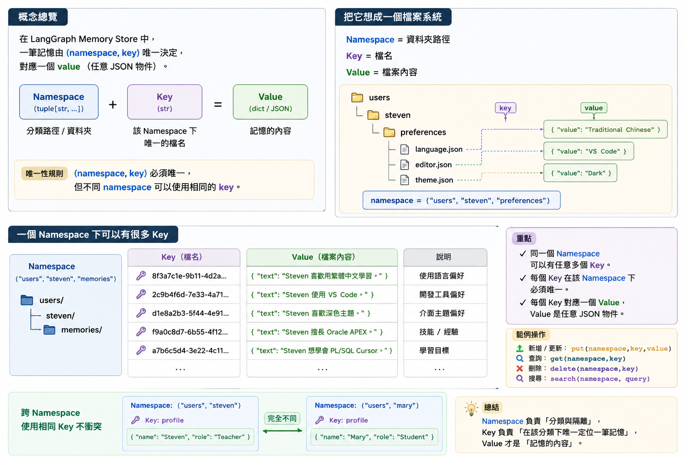
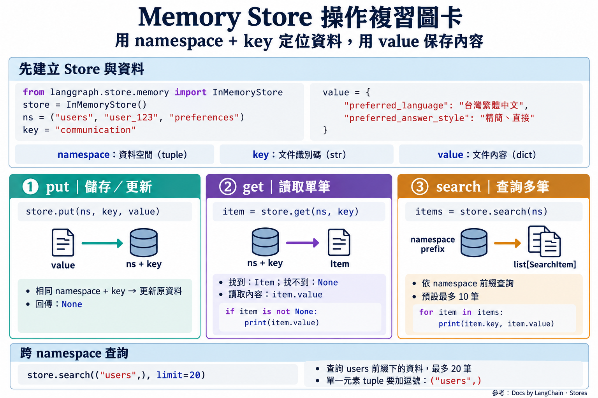
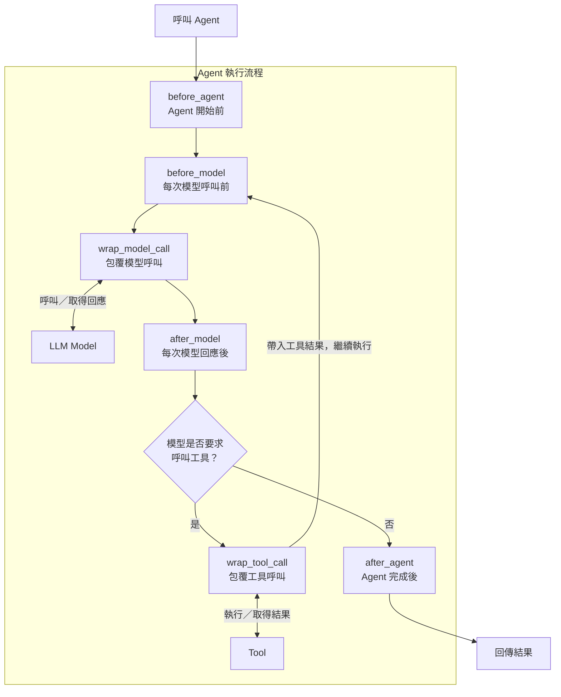

# Memory Store in LangChain Agents (一)

## 學習目標

完成本章後，學生能：

1. 說明 Memory Store 的用途及其與 Checkpointer 的差異。
2. 使用 `namespace`、`key` 與 `value` 組織資料。
3. 操作 Memory Store，儲存、讀取與查詢資料。
4. 區分 Static runtime context、Agent State 與 Memory Store 的責任。
5. 透過 Middleware 產生動態 System Prompt，套用使用者偏好。

## Memory Store

### Why Memory Store

Short-Term Memory 儲存特定 `thread_id` 的對話歷史.

但是，有些情境需要跨越不同的 thread 的資料，例如：

- User 偏好使用繁體中文；
- User 希望回覆簡短、直接；
- User 偏好的配送方式；
- 多個 Agent 或多段對話都需要使用的應用程式知識。

**Memory Store** 可保存跨 thread 的資料，並可由不同的 Agent 或對話 thread 讀取與更新。

- 扮演 long-term memory 的角色


### Memory Store 與 Checkpointer 的差異

Checkpointer 和 Memory Store 都可以保存資料，但兩者保存的資料及存取範圍不同。

| Aspect | Checkpointer | Memory Store |
|---|---|---|
| Memory type | Short-term memory | Long-term memory |
| 保存內容 | Agent state 的 checkpoint | 應用程式自行定義的 JSON document |
| 存取範圍 | 同一個 `thread_id` | 可跨不同 thread |
| 定位資料的方式 | `thread_id` | `namespace` 與 `key` |
| 常見用途 | Message history、目前工作狀態 | User 偏好、穩定事實、共享知識 |

一個 Agent 可以同時使用兩者：

```text
Agent
 |-- Checkpointer: 保存各個 thread 的 Agent state
 |-- Memory Store: 保存可跨 thread 使用的 long-term memory
```

### Memory Store 的資料儲存

LangChain 的 `Memory Store` 抽象化了資料儲存及操作方式，讓開發者可以在不同的儲存後端之間切換，而不需要大幅的修改程式碼。

`Memory Store` 的資料可存入記憶體或資料庫。

同樣，Short-Term Memory 的 Checkpointer 也可以存入記憶體或資料庫。

在測試或開發階段，使用記憶體儲存的 Memory Store 與 Checkpointer 可以快速驗證程式邏輯。

在正式部署時，使用資料庫儲存的 Memory Store 與 Checkpointer 可以確保資料的持久性。

### Memory Store 的資料結構

Memory Store 使用 `namespace` 來切割不同的資料空間
每個 `namespace` 可以包含多個 `key`
每個 `key` 對應一個 JSON document，這個 document 可以是任意的 JSON 物件。

namespace 由一個 tuple 組成，內可有多個元素，用以表示同個 namespace 的不同層級。
- 好像是階層資料夾的概念，方便將不同類型的資料分開管理。

例如，使用 User + Memory Type 方式來切割不同的 namespace：

```python
namespace_profile = ("user_123", "profile")
namespace_preferences = ("user_123", "preferences")
namespace_facts = ("user_123", "facts")
```

切割出的 namespace 如下:

```
user_123
 ├── profile
 ├── preferences
 └── facts
```




### Namespace + key 決定唯一的資料位置

LangGraph Store 將每一筆 long-term memory 保存為一份 JSON document，並使用
以下三個部分組織資料：

- `namespace`：由字串組成的 tuple，像資料夾路徑，用來劃分資料範圍。
- `key`：該 namespace 中一筆資料的唯一識別碼，像檔案名稱。
- `value`：實際保存的 JSON-compatible dictionary。

`namespace` + `key` 決定唯一的資料位置。

例如: `user_123` 和 `user_456` 的 `preferences` namespace 是不同的資料夾，兩者可以保存不同的資料。

```
memory_store
 ├── ("user_123", "preferences") / "language" → {"language": "zh-TW"}
 └── ("user_456", "preferences") / "language" → {"language": "en-US"}
```

## Memory Store 的基本操作方法

https://docs.langchain.com/oss/python/langgraph/stores#basic-usage

### Create a Memory Store

使用 [`InMemoryStore`](https://reference.langchain.com/python/langgraph.store/memory/InMemoryStore) 來說明 Memory Store 的基本操作。

`InMemoryStore` 將資料保存在記憶體中，適合在測試或開發階段使用。
- 當要存到實體檔案或資料庫時，可使用 `PostgresStore`, `MongoStore`, [`RedisStore`](https://reference.langchain.com/python/langchain-community/storage/redis/RedisStore) 等
- 他們都繼承 `BaseStore`，所以操作方式相同。


`InMemoryStore` 以 dictionary 實作，並支援向量(語意)搜尋。

建立最簡單的 `InMemoryStore`:

```python
from langgraph.store.memory import InMemoryStore
store = InMemoryStore()
```

Note: 此類別位於 `langgraph.store.memory`，不是 `lanchain`. 


### 將文件放入 namepsace 

使用 [`store.put(namespace, key, value)` -> None](https://reference.langchain.com/python/langgraph.store/base/BaseStore/put) 儲存或更新一筆資料。
- namespace 為 tuple
- key 為字串(相當於文件名稱)
- value 為 dict (相當於文件內容)

假設 store 用以下方式存放使用者偏好的文件

```
users 
 └── user_123
     └── preferences
         └── communication:
             {"preferred_language": "台灣繁體中文", "preferred_answer_style": "精簡、直接"}
```

namespace tuple 為 `("users", "user_123", "preferences")`，key 為 `"communication"`，value 為 dictionary. 

Communication 文件中含 有使用者偏好的語言與回答風格，例如：

```json
{
    "preferred_language": "台灣繁體中文",
    "preferred_answer_style": "精簡、直接"
}
```

則將上述資料存入 Memory Store 的程式碼如下：

```python
store.put(
    namespace = ("users", "user_123", "preferences"),
    key = "communication",
    value = {
        "preferred_language": "台灣繁體中文",
        "preferred_answer_style": "精簡、直接"
    }
)
```

再放入 `user_456` 的偏好資料：

```python
store.put(
    namespace = ("users", "user_456", "preferences"),
    key = "communication",
    value = {
        "preferred_language": "English",
        "preferred_answer_style": "detailed"
    }
)
```

### 讀取單個 namespace 下的多個文件(items) 

使用[ `store.search` -> list[SearchItem]](https://reference.langchain.com/python/langgraph.store/base/BaseStore/search) 讀取資料, 該方法回傳該 namespace 下的所有 item, 其型態為 `list[SearchItem]`, 預設回傳 10 筆資料。

[`SearchItem`](https://reference.langchain.com/python/langgraph.store/base/SearchItem) 中:
- `namespace`: 文件所件的 namespace
- `key`: 該 namespace 中一筆資料的唯一識別碼，像檔案名稱。
-  `value`: 屬性即是存入的 dictionary 資料。

此外，它還提供其他的 metadata, 如 namespace, created_at, updated_at 等。

例如，讀取 `user_123` 的偏好資料，並逐一印出其 key 與 value:

```python
items = store.search(("users", "user_123", "preferences"))

for item in items:
    print(f"Key: {item.key}, Value: {item.value}")
```

```
Key: communication, Value: {'preferred_language': '台灣繁體中文', 'preferred_answer_style': '精簡、直接'}
```

操作 `search` 方法時，使用位置參數傳入 `namespace_prefix`, 即可列出該 namespace prefix 下的所有 items.


Ref: https://docs.langchain.com/oss/python/langgraph/stores

### 讀取多個 namespace 下的多個文件

`store.search` 也可列出多個 namespace 下的所有 items, 例如列出 `user_123` 與 `user_456` 的偏好資料。

只要提供部份的 namespace prefix 即可，例如 `("users",)`, 就可以列出所有使用者的偏好資料。

```python
items_multiple_namespace = store.search(("users",), limit=20)

# print 
for item in items_multiple_namespace:
    print(f"Namespace: {item.namespace}, Key: {item.key}, Value: {item.value}")
```

```
Namespace: ('users', 'user_123', 'preferences'), Key: communication, Value: {'preferred_language': '台灣繁體中文', 'preferred_answer_style': '精簡、直接'}
Namespace: ('users', 'user_456', 'preferences'), Key: communication, Value: {'preferred_language': 'English', 'preferred_answer_style': 'detailed, step-by-step'}
```


注意:
- 寫 tuple 時，若只有一個元素，記後後面要加逗號，例如 `("users",)`，否則會被視為字串。
> type(("users")) -> <class 'str'>
> type(("users",)) -> <class 'tuple'>

Ref: https://docs.langchain.com/oss/python/langgraph/stores#listing-items-in-a-namespace

### 取得單一 item

使用 [`store.get(namespace, key)` -> Item | None](https://reference.langchain.com/python/langgraph.store/base/BaseStore/get) 取得單一 [Item 物件](https://reference.langchain.com/python/langgraph.store/base/Item)。

例如，取得 `user_123` 的偏好資料:

```python
comm_pref = store.get(
    namespace = ("users", "user_123", "preferences"),
    key = "communication"
)

print(comm_pref)
```

Item 物件的結構和 `SearchItem` 類似, 有 namespace, key, value, created_at, updated_at 等屬性。

```
Item(namespace=['users', 'user_123', 'preferences'], key='communication', value={'preferred_language': '台灣繁體中文', 'preferred_answer_style': '精簡、直接'}, created_at='2026-08-13T02:22:44.103841+00:00', updated_at='2026-08-13T02:22:44.103846+00:00')
```

### Memory Store 操作複習圖卡



### 其它功能

參考 [Semantic search support, Stores - Docs by LangChain](https://docs.langchain.com/oss/python/langgraph/stores#semantic-search-support)

請同學自行研究:
- 語意搜尋 query 
- 過濾 filter 


## 使用 Long-Term Memory 的情境

LLM 模型無法直接讀取 Memory Store 的內容。

開發者必須在適當的時間，取得需要 Memory Store 的內容，放入 System Prompt 中，或者撰寫工具讀取 Memory Store.

#### 情境 1: 方法一：注入 dynamic system prompt

適合「每次回覆都應套用」的穩定資訊，例如回覆的語言、風格。

觀念:
```
Memory Store
    ↓ 讀取 User 偏好
Dynamic system prompt
    ↓
LLM
```


#### 情境 2: 方法二: 使用 Tool 依需要讀取

適合不一定每次都需要查詢，由 Agent 判斷需要查詢的時機。

觀念:
```
LLM
 ↓ tool call
Tool → Memory Store
 ↓ tool result
ToolMessage
 ↓
LLM
```

於 [memory_store_2](memory_store_2.md) 介紹情境 2 的實作。

## 實作 1: 儲存及套用使用者的偏好

當使用者要求特定的對談與回應偏好時，ChatBot 會記住使用者的偏好，並在後續的對話中
將這些偏好加動態地入到 System Prompt，以便在回應中提供更個性化的回應。

例如，要求：
- 用中文或其它語言回答，或者
- 回答的內容要精簡。

實作 1 展示使用 Memory Store 內的資料產生動態的 System Prompt。


Main reference: [Runtime - Docs by LangChain](https://docs.langchain.com/oss/python/langchain/runtime?_gl=1*lvfwfh*_gcl_au*MTUxMzgyNzc4Mi4xNzgzNjk3MDYy*_ga*MTE0ODYzNjc0MC4xNzc0NTczMDU3*_ga_47WX3HKKY2*czE3ODY1ODMzMDAkbzQ3JGcxJHQxNzg2NTkxNzE4JGozMyRsMCRoMA..)

### 情境設計

兩位 user 的使用偏好:

- user_123: 繁體中文; 精簡、直接
- user_456: English; detailed, step-by-step

兩位使用者都詢問：

```text
請說明什麼是採購單。
```

### 運作流程

1. 將登入的 `user_id` 放入 Agent 的 [Static runtime context (靜態執行環境上下文)](https://docs.langchain.com/oss/python/concepts/context) 中(不是放在短期記憶中)。
   - invoke agent 時存入，不是在建立 agent 時存入。
2. 使用 Middleware, 攔截每次模型呼叫, 讀取 Memory Store 中的使用者偏好, 並回傳動態的 System Prompt
3. 使用動態的 System Prompt 來呼叫 LLM, 並回覆使用者。

### 靜態執行環境上下文(Static runtime context)

- 專門用來儲存 user metadata, 工具清單, 或資料庫連線資訊等，不會隨對話改變的資訊。

- 如果資料會隨對話改變，應使用
  - AgentState (LangChain) (或 State object (LangGraph)) 儲存，但只限於同一個 thread_id 的對話歷史，無法跨 thread 使用。
  - Memory Store (LangGraph) 儲存跨 thread 的資料。


### 建立 Store 

延用先前的程式碼，建立一個 `InMemoryStore`，並放入兩位使用者的偏好資料。

```python
from langgraph.store.memory import InMemoryStore
store = InMemoryStore()

# User 123 偏好
store.put(
    namespace = ("users", "user_123", "preferences"),
    key = "communication",
    value = {
        "preferred_language": "台灣繁體中文",
        "preferred_answer_style": "精簡、直接"
    }
)

# User 456 偏好
store.put(
    namespace = ("users", "user_456", "preferences"),
    key = "communication",
    value = {
        "preferred_language": "English",
        "preferred_answer_style": "detailed, step-by-step"
    }
)
```

### 建立 Static runtime context 的 schema (資料結構)

使用 `@dataclass` 建立自己的 Static runtime context 的 schema。
之後，會在建立 Agent 進行綁定。

```python
from dataclasses import dataclass

@dataclass
class UserStaticContext:
    user_id: str
```

### 建立 System Prompt

```python
BASE_SYSTEM_PROMPT = """
你是一位 ERP 的教師，說明與解釋 ERP 的概念與商業流程。
你不會回答系統操作的流程問題。

回答必須正確、清楚。

如果訓練資料中沒有明確的答案，請說明「我不確定」或「我不知道」，不要亂猜。
如果是臆測的答案，請在回答中說明「這是我的臆測」。

"""
```

回覆的語言與風格會在 Middleware 中動態地加入到 System Prompt 中。

### 建立 Middleware function

LangChain 的 Middleware 可攔截 Agent 的執行過程，允許開發者介入過程，插入自訂邏輯(執行函數)，以達到控制、審計與攔截的目的。

這些介入點，或稱為掛載點(Hooks) 有:

| Hook           | 執行時機                    | 常見用途                             |
| -------------- | --------------------------- | ------------------------------------ |
| `before_agent` | 每次 Agent 執行開始前，一次 | 初始化、檢查輸入                     |
| `before_model` | 每次模型呼叫前              | 檢查或更新 Agent State、整理訊息     |
| `after_model`  | 每次模型回應後              | 檢查回應、記錄結果、更新 Agent State |
| `after_agent`  | 每次 Agent 執行完成後，一次 | 記錄整體結果、最後處理               |

底下的 @dynamic_prompt 所修飾的函數，就是掛載下 `before_model`. 

- 在每次模型呼（Model Call）前觸發 `model_request`，允許開發者取得運行時上下文（Runtime Context），以動態產生或修改系統提示詞（System Prompt）

使用 `@dynamic_prompt` decorator 去裝飾函數，使其能取得 [`ModelRequest` 物件](https://reference.langchain.com/python/langchain/agents/middleware/types/ModelRequest?_gl=1*wofxu3*_gcl_au*MTUxMzgyNzc4Mi4xNzgzNjk3MDYy*_ga*MTE0ODYzNjc0MC4xNzc0NTczMDU3*_ga_47WX3HKKY2*czE3ODY1OTY1MTkkbzQ4JGcxJHQxNzg2NTk4MzQ5JGo2MCRsMCRoMA..)，更新 System Prompt，之後回傳新的 str 或 `SystemMessage` 物件。

函數的簽名如下:

```python
@dynamic_prompt
def user_dynamic_prompt(request: ModelRequest[ContextT]) -> str | SystemMessage:
    ...
```

其中 `ContextT`為自訂的 Static Runtime Context 的型別(泛型型別參數)。


這個函數執行的流程如下:

1. 從 modelRequest 的 `runtime` 中取得 static runtime context 中的 user_id
2. 從 modelRequest 的 `runtime`中取得目前的 store 
3. 操作 Memory Store，去該 user_id 的 namespace 取得偏好資料
4. 製作回覆的語言與風格的文字說明
5. 從 modelRequest 中取得目前的 System Prompt (str)
6. 將這些文字說明加入到 System Prompt 中，並回傳新的 System Prompt

```python
from langchain.agents.middleware import dynamic_prompt, ModelRequest
from langchain.messages import SystemMessage

@dynamic_prompt
def user_dynamic_prompt(request: ModelRequest[UserStaticContext]) -> str | SystemMessage:
    """
    此 Middleware 會根據目前使用者的偏好，動態修改 System Prompt。

    流程如下：
    1. 從 runtime context 取得使用者 ID。
    2. 從 Memory Store 讀取該使用者的溝通偏好。
    3. 取得偏好的回覆語言與回答風格。
    4. 將偏好設定附加至目前的 System Prompt。
    5. 回傳更新後的 SystemMessage。

    :param request: ModelRequest 物件，包含 runtime context 與 store。
    :return: 更新後的 SystemMessage，包含使用者偏好設定。

    """
    # 1. 從 modelRequest 中取得 static runtime context 中的 user_id
    # UserStaticContext is the context scheme
    user_id = request.runtime.context.user_id

    # 2. 從 modelRequest 中取得目前的 store
    store = request.runtime.store

    # 3. 操作 Memory Store，去該 user_id 的 namespace 取得偏好資料
    # Namespace format: ("users", user_id, "preferences")

    comm_pref = (
        store.get(
        namespace = ("users", user_id, "preferences"),
        key = "communication")
        if store is not None else None
    )

    # get the preference 
    preferences = comm_pref.value if comm_pref is not None else {}

    # 4. 製作回覆的語言與風格的文字說明
    
    style_instruction = f"請使用 {preferences.get('preferred_language', 'French')} 回覆，並且回答的內容要 {preferences.get('preferred_answer_style', '精簡、直接')}。"

    # 5. 從 modelRequest 中取得目前的 System Prompt
    current_system_prompt = request.system_prompt if request.system_prompt is not None else ""

    # 6. 將這些文字說明加入到 System Prompt 中，並回傳新的 System Prompt
    dynamic_system_prompt = current_system_prompt.strip() + "\n" + style_instruction

    # 僅供觀察；正式環境可改用 logging
    print("=== Current System Prompt ===")
    print(current_system_prompt)
    print("=== Dynamic System Prompt ===")
    print(dynamic_system_prompt)

    return SystemMessage(content=dynamic_system_prompt)
```

### 建立 Agent

建立 Agent 時，提供 Static runtime context 的 schema (context_schema), Memory Store (store), 以及 Middleware function (middleware) 的物件實體給 Agent。

```python
from langchain.agents import create_agent

agent = create_agent(
    model="gpt-5-nano",
    system_prompt=BASE_SYSTEM_PROMPT,
    tools=[],
    context_schema=UserStaticContext, # User's static runtime context schema
    store=store,  # Memory Store
    middleware=[user_dynamic_prompt] # Middleware functions
)

```

### 比較兩位使用者

建立第一使者用者的問題.

建立一個 AgentState 物件

```python
user_123_question = {
    "messages": [
        { "role": "user", "content": "請說明什麼是請購到採購的商業流程。" }
    ]
}
```

要求 Agent 回覆 user_123 的問題，並印出回覆內容。

**初始化 Static Runtime Context**

在 invoke 時，使用 `context` 參數傳入 `UserStaticContext` 的物件，並指定 user_id 為 "user_123"。

```python
result_123 = agent.invoke(
    user_123_question,
    context=UserStaticContext(user_id="user_123")
)

# print the response
print (result_123["messages"][-1].content)
```

回覆內容:

```
=== Current System Prompt ===

你是一位 ERP 的教師，說明與解釋 ERP 的概念與商業流程。
你不會回答系統操作的流程問題。

回答必須正確、清楚。

如果訓練資料中沒有明確的答案，請說明「我不確定」或「我不知道」，不要亂猜。
如果是臆測的答案，請在回答中說明「這是我的臆測」。


=== Dynamic System Prompt ===

你是一位 ERP 的教師，說明與解釋 ERP 的概念與商業流程。
你不會回答系統操作的流程問題。

回答必須正確、清楚。

如果訓練資料中沒有明確的答案，請說明「我不確定」或「我不知道」，不要亂猜。
如果是臆測的答案，請在回答中說明「這是我的臆測」。


請使用 台灣繁體中文 回覆，並且回答的內容要 精簡、直接。
```


製作 user_456 的問題，並要求 Agent 回覆。

```python
user_456_question = {
    "messages": [
        { "role": "user", "content": "請說明什麼是請購到採購的商業流程。" }
    ]
}   
result_456 = agent.invoke(
    user_456_question,
    context=UserStaticContext(user_id="user_456")
)  

# print the response
print (result_456["messages"][-1].content)
```

回覆內容:

```
=== Current System Prompt ===

你是一位 ERP 的教師，說明與解釋 ERP 的概念與商業流程。
你不會回答系統操作的流程問題。

回答必須正確、清楚。

如果訓練資料中沒有明確的答案，請說明「我不確定」或「我不知道」，不要亂猜。
如果是臆測的答案，請在回答中說明「這是我的臆測」。


=== Dynamic System Prompt ===

你是一位 ERP 的教師，說明與解釋 ERP 的概念與商業流程。
你不會回答系統操作的流程問題。

回答必須正確、清楚。

如果訓練資料中沒有明確的答案，請說明「我不確定」或「我不知道」，不要亂猜。
如果是臆測的答案，請在回答中說明「這是我的臆測」。


請使用 English 回覆，並且回答的內容要 detailed, step-by-step。
```


## 補充 1： ModelRequest 物件

[ModelRequest | langchain](https://reference.langchain.com/python/langchain/agents/middleware/types/ModelRequest?_gl=1*wofxu3*_gcl_au*MTUxMzgyNzc4Mi4xNzgzNjk3MDYy*_ga*MTE0ODYzNjc0MC4xNzc0NTczMDU3*_ga_47WX3HKKY2*czE3ODY1OTY1MTkkbzQ4JGcxJHQxNzg2NTk4MzQ5JGo2MCRsMCRoMA..#member-system_message-2)

此類別繼承 `Generic[ContextT]`

在建立此類別時，使用 `ContextT` 來指定 static runtime context 的 schema。

此 `ContextT` 會做為 `ModelRequest` 物件中的 runtime 屬性的型別參數，即 `Runtime[ContextT]`。


## 補充 2: Middleware 提供的介入時機點

`before_agent`, `before_model`, `after_model`, `after_agent`



