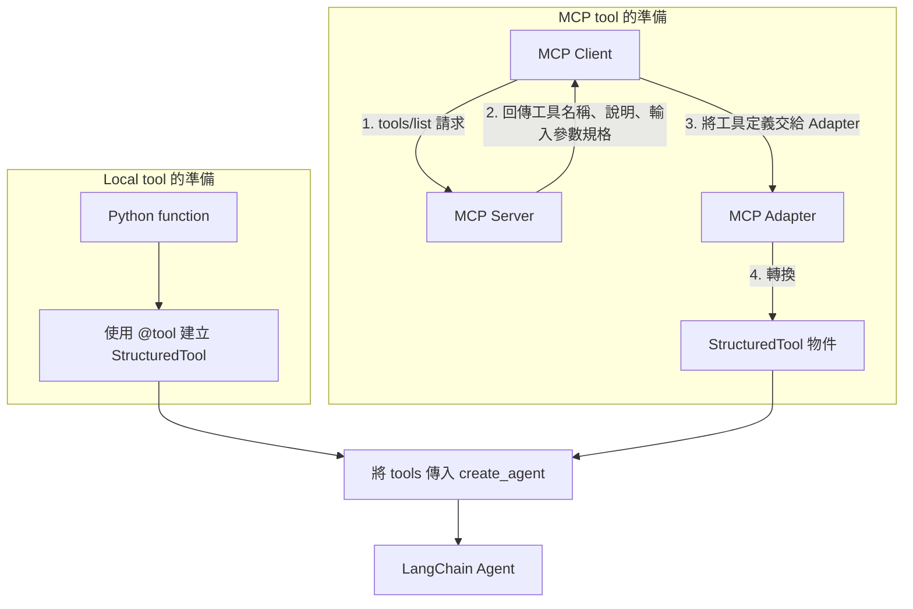
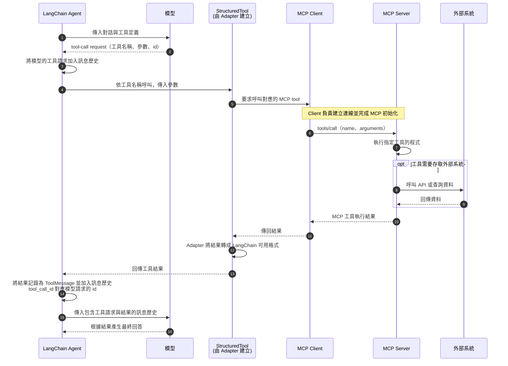

# 使用 Model Context Protocol (MCP) 連接外部工具

，
## 學習目標

完成本章後，學生應能：

1. 說明 MCP 如何透過標準化介面，減少 AI application 整合外部工具的重複工作。
2. 區分 MCP Host、Client 與 Server 的責任，並描述工具請求與結果的傳遞流程。
3. 比較 Local tool 與 MCP tool 的定義來源、載入方式及執行位置，說明 MCP 工具如何配合 Tool Calling 使用。
4. 使用 LangChain MCP Adapter 連接 DeepWiki MCP Server，取得工具清單並建立可呼叫外部工具的 Agent。
5. 設計 System Prompt，指定目標 GitHub repository 與工具使用要求，並以非同步方式呼叫 Agent 取得回答。
6. 區分 Agent 對話歷史與 MCP session 的用途，說明本章範例若要支援多輪對話，需要維護哪些訊息。

## Why MCP?

在上一章 **Tool Calling** 中，我們自行撰寫 `get_order_status()` Python function，使用 `@tool` 將它轉換成 `StructuredTool` ，再交給 Agent 使用。

這種方式適用於撰寫自己的工具。

但是，當 Agent 需要使用 GitHub、Google Drive、資料庫或其他外部服務時，每增加一項能力，開發者通常都必須：

1. 閱讀外部服務的 API 文件。
2. 撰寫呼叫 API 的 Python function。
3. 定義工具的名稱、說明 (或撰寫 argument schema, 參考補充 1)。
4. 處理認證、網路連線及錯誤。
5. 將 function 轉換成 `StructuredTool`
6. 將 tool 註冊給 Agent。

如果多個 AI applications 都要連接相同的外部服務，每個 application 都各自撰寫一套整合程式，便會產生大量重複工作。

當外部 API 改版時，這些整合程式也必須分別維護。

### The External Tool Integration Problem

假設三個 AI applications 都需要存取 GitHub、Google Drive 與公司資料庫。在沒有共同標準的情況下，每個 application 都需要為每個外部服務建立專用的連接程式：

```text
AI Application A ── custom integration ── GitHub
                 ├─ custom integration ── Google Drive
                 └─ custom integration ── Database

AI Application B ── custom integration ── GitHub
                 ├─ custom integration ── Google Drive
                 └─ custom integration ── Database
```

Application 與外部服務的數量越多，需要開發及維護的連接程式也越多。

要解決此問題:

1. 將外部服務的整合程式獨立出來並實作，放在一個 Server 
2. 提供標準化的介面，讓 AI applications 可以透過相同的方式呼叫這些外部服務。

MCP 就是為了這個目的而設計的開放標準。

### MCP 提供標準化的介面

**Model Context Protocol (MCP)** 是連接 AI applications 與外部系統的開放標準。

工具提供者可以透過 **MCP Server** 公開可用的工具；
AI application 則透過 **MCP Client** 發現並呼叫這些工具。

```text
AI Application
      ↓
MCP Client
      ↓  standard protocol
MCP Server
      ↓
External system
```

因此，開發者不必在目前的 application 中重新實作每一個外部工具。
只要外部 MCP Server 已經提供了工具，application 就可以透過 MCP Client 取得這些工具，並將它們轉換成 `StructuredTool` 供 Agent 使用。

## MCP 架構

Model Context Protocol（MCP）採用用戶端—伺服器(client-server)架構，包含 Host、Client 與 Server 三個核心元件。

核心元件

* Host（主應用程式）：執行大型語言模型並發起連線的應用程式，例如 Agent 應用程式或 IDE。
* Client（用戶端）：位於 Host 內部的通訊元件，負責維持與特定 Server 的一對一連線。
* Server（伺服器）：獨立執行的程序，提供外部資料、檔案或工具，供 AI 使用。


## Local tool 與 MCP tool 的差異

使用程序分成兩個階段：先載入工具並建立 Agent，再由 Agent 根據模型的請求執行工具。

**1. 載入工具並建立 Agent**

Local tool 由 application 使用 `@tool` 建立。MCP tool 則先透過 MCP Client 向 Server 發出 `tools/list`（查詢工具清單）請求，取得工具名稱、說明與輸入參數規格。

本章使用的 `langchain-mcp-adapters` 套件提供 MCP Client 的管理功能，以及工具格式的轉換功能。

Adapter 會建立可代為呼叫 Server 的 `StructuredTool`，再將這些物件傳入 `create_agent()`。
- Adapter 建立的 `StructuredTool` 會在內部綁定了底層 MCP Client 的連線實例（Session），可直接呼叫 MCP Server 執行工具。



**2. 執行 MCP tool 並使用結果**

Agent 呼叫模型時，會提供對話與工具定義。模型選擇工具並產生參數後，Agent 的工具執行流程會呼叫對應的 tool。

該工具透過 MCP Client 發出 `tools/call`（執行指定工具）請求，由 MCP Server 執行。

下圖呈現需要一次工具呼叫即可回答的情況；模型若需要更多資料，Agent 會繼續工具呼叫迴圈。




兩者的主要差異在於工具由誰定義，以及實際在哪裡執行：

| | Local LangChain tool | MCP tool |
|---|---|---|
| Tool definition | 目前的 application 使用 `@tool` 定義 | MCP Server 提供 |
| Tool metadata | 來自 function name、docstring 與 type hints | 來自 MCP Server |
| Tool execution | 通常在 application process 中執行 | 由 MCP Server 執行 |
| Agent 的使用方式 | 透過 Tool Calling 使用 | 轉換成 `StructuredTool` 後，仍透過 Tool Calling 使用 |

MCP 改變的是**外部工具的整合方式**，而不是模型決定何時使用工具的機制。
Agent 仍然會根據對話內容選擇工具、產生 tool-call request，並使用工具回傳的結果產生最終回答。


參考資料：

- [Model Context Protocol: Introduction](https://modelcontextprotocol.io/docs/getting-started/intro)
- [LangChain: Model Context Protocol (MCP)](https://docs.langchain.com/oss/python/langchain/mcp)
- [LangChain MCP Adapters：工具載入與 Agent 整合](https://github.com/langchain-ai/langchain-mcp-adapters)
- [MCP Specification：tools/list 與 tools/call](https://modelcontextprotocol.io/specification/2025-06-18/server/tools)


## 在 LangChain 中使用 MCP 遠端工具的步驟

前置準備：

- 安裝 `langchain-mcp-adapters` 套件。
- 向外部工具提供者取得 MCP Server 的 URL。
  - 若伺服器需要身分驗證，請申請 API 金鑰或權杖（token）。

在 LangChain 應用程式中：

1. 建立 MCP Client 實例：
   - 使用此實例連線至 MCP Server 的 URL。
2. 查詢 MCP Server 提供的可用工具：
   - 使用 Client 取得 MCP Server 的工具清單。
   - 自動轉成 `StructuredTool`
3. 使用取得的工具建立 Agent 實例：
   - 將工具傳入 `create_agent()` 函式，建立可使用這些工具的 Agent。
4. 使用 `await agent.ainvoke()` 非同步呼叫 Agent。
5. 處理 Agent 的回應。

## Install MCP Adapter

LangChain 官方維護 [`langchain-mcp-adapters` 套件](https://reference.langchain.com/python/langchain-mcp-adapters)
讓開發者能夠直接將 MCP 規格的工具、提示詞和資源，轉換為 LangChain 標準格式，達到「一次編寫，跨框架通用」的目的

核心功能:
* 工具格式轉換：自動將 MCP Server 上的 Tools 轉化為 `StructuredTool`（如 @tool 或 BaseTool），供大型語言模型（LLM）使用。
* 多伺服器連接：內建 MultiServerMCPClient，支援同時串接多個獨立的 MCP 伺服器，集中管理異質數據源。

在 uv project 中安裝此套件:

```bash
uv add langchain-mcp-adapters
```

## MCP Server: DeepWiki 

底下使用 DeepWiki MCP Server 作為範例，說明如何在 LangChain 中使用 MCP 工具。

### DeepWiki 

DeepWiki 是由 Cognition AI 公司推出的 AI 程式碼知識平台；

目標是將任何公開的 GitHub Repository 自動轉換成一份可以瀏覽、搜尋、對話的 Wiki

只要輸入 GitHub Repository，例如：`https://github.com/langchain-ai/langchain` ，DeepWiki 就會分析整個程式碼庫，自動將 Repo 轉換成結構完整的維基（Wiki）文檔、架構圖，並提供聊天問答功能，讓開發者能直接對代碼庫提問。


公開 MCP Server：

``` text
https://mcp.deepwiki.com/mcp
```

DeepWiki 主要提供以下工具：

- `read_wiki_structure`
- `read_wiki_contents`
- `ask_question`

### 連線

使用 `langchain_mcp_adapters.client.MultiServerMCPClient` 建立 MCP Client

連線時，需要：

- 指定使用的 transport layer (e.g., `stdio` for local, `http` for remote) 及 
- MCP Server URL. 

```python
from langchain_mcp_adapters.client import MultiServerMCPClient

deep_wiki_client = MultiServerMCPClient(
    {
        "deepwiki": {
            "transport": "http",
            "url": "https://mcp.deepwiki.com/mcp",
        }
    }
)
```

說明：

- `"deepwiki"` 是 application 自訂的 server name。
- `transport="http"` 表示使用 Streamable HTTP。
- `url` 是服務提供者公布的 MCP endpoint。
- 即使只有一個 MCP Server，也可以使用 `MultiServerMCPClient`。

提醒: 
- MCP Server 資訊沒有指定要分析的 GitHub repository
- 這個 repository 參數會在使用工具時傳入，例如：`ask_question` 工具的 `repoName` 參數。
  - 會由 System Prompt 指定，或由 Agent 在對話中決定。

參考資料：
- [DeepWiki MCP documentation](https://docs.devin.ai/work-with-devin/deepwiki-mcp)

### 取得工具清單

呼叫 `MultiServerMCPClient` 物件的 `get_tools() ` 非同步方法，取得 Server 提供的工具。

- 該方法會呼叫 MCP adapter,  回傳`StructuredTool` 物件，供 Agent 使用。

因為查詢工具清單會產生網路請求，所以使用非同步方式操作。

```python
# 取得 DeepWiki MCP Server 提供的工具清單
tools = await deep_wiki_client.get_tools()
```

印出工具的 metadata：

```python
for tool in tools:
    print(f"Tool name: {tool.name}")
    print(f"Tool description: {tool.description}")
    print(f"Tool input schema: {tool.args_schema}")
    print("-" * 40)
```

其中

- `args_schema` 是工具的輸入參數格式模型，通常是 JSON Schema。

例如 `ask_question` 工具的輸入參數格式：

```text
{'properties': {'question': {'description': 'The question to ask about the '
                                            'repository.',
                             'type': 'string'},
                'repoName': {'anyOf': [{'type': 'string'},
                                       {'items': {'type': 'string'},
                                        'type': 'array'}],
                'description': 'GitHub repository or list of '
                                            'repositories (max 10) in '
                                            'owner/repo format.'}},
 'required': ['repoName', 'question'],
 'type': 'object'}
```

## 使用 MCP 工具

### 設計 System Prompt

需要設計一個適當的 System Prompt，以指導 Agent 如何正確地使用 MCP Server 提供的工具。

以下提示詞提示了: 角色、目標 repo、必要行為：

```py
system_prompt = """
You are an assistant for studying the source code of LangChain.
You use the DeepWiki MCP tools to answer questions about the LangChain repository.

Target repository in the format of owner/repository is:
- langchain-ai/langchain

Mandatory behavior:
- For questions about LangChain implementation, architecture, modules,
  classes, functions, or execution flow, call a DeepWiki MCP tool before
  answering.
- Do not use the pre-trained knowledge of the model to answer questions about LangChain repository-specific questions.
- Use ask_question for a focused implementation question.
- Use read_wiki_structure to discover available documentation sections.
- Use read_wiki_contents to inspect a relevant section.
- If DeepWiki does not provide enough evidence, state that limitation.
- Answer in Traditional Chinese.
"""
```

注意 Prompt 中的 Target repository:

- DeepWiki 使用`owner/repository` 格式指定 GitHub repository，例如：`langchain-ai/langchain`, 所以必須明確告訴 Agent 目標 repository 是哪一個。

- 這個 `owner/repository` 會傳入 `ask_question` 工具的 `repoName` 參數。


### Create Agent with the returned MCP tools

`MultiServerMCPClient` 會將 MCP Server 回傳的工具 metadata 轉換成 LangChain tool objects。
可以直接傳入 `create_agent()`，建立 Agent。

```python
from langchain.agents import create_agent

lanchain_doc_agent = create_agent(
    model="gpt-5-nano",
    tools=tools,
    system_prompt=system_prompt)
```


### 建議的測試問題

可以依序測試：

1. 讀取 langchain repo 的 Wiki structure，列出與 Agent 相關的主要章節。
2. 說明 langchain-ai/langchain 中 create_agent 的定義位置、輸入參數及回傳型態, 並提供使用範例。
3. 說明 create_agent 執行 tool calling 時， AIMessage、ToolMessage 與 tool_call_id 的關係。
4. 說明 LangChain Agent 與 LangGraph 在目前 repository 中的責任分工。

### 測試問題 1 範例

```python
question_1 = "請讀取 langchain repo 的 Wiki structure，列出與 Agent 相關的主要章節。"
state = {
      "messages": [
          {"role": "user", "content": question_1}
      ]
}
response_1 = await lanchain_doc_agent.ainvoke(state)
print(response_1["messages"][-1].content)
```

可能的輸出結果:

```
('以下是 Wiki 結構中與 Agent 相關的主要章節（位於 4. Agent System）：\n'
 '\n'
 '- 4. Agent System\n'
 '  - 4.1 Agent Creation and Middleware Architecture\n'
 '  - 4.2 Middleware Implementations\n'
 '  - 4.3 Structured Output and Response Formats\n'
 '  - 4.4 Configuration and Runtime Control\n'
 '\n'
 '如需，我可以進一步檢視各小節的內容或整理成摘要。')
```

## 目前 Agent 的限制

Agent 對談歷史的維護方式，會影響多輪對話的能力:
- 目前實作的 Agent 仍然是單輪對話，無法保留多輪對話的上下文。
  - 因為沒有更新 Agent 的 state (或對話歷史)，所以每次呼叫 `ainvoke()` 都是獨立的對話。
- 若要進行多輪對話，則必須維護對話歷史(短期記憶)，並在每次呼叫 `ainvoke()` 時將對話歷史傳入 state。

MCP session 狀態:
- MultiServerMCPClient 預設是 stateless
- 每次 tool invocation 會建立新的 MCP session，執行後再清除

我們下一章將介紹在 Agent 中使用 **Memory**，讓 Agent 能夠保留對話歷史，進行多輪對話。


## 補充

補充 1: 撰寫工具函數的 Argument Schema
參考： [Advanced schema definition | Tools - Docs by LangChain](https://docs.langchain.com/oss/python/langchain/tools#advanced-schema-definition)


## 本章重點整理

1. **MCP 統一外部工具的連接方式。** 工具提供者透過 MCP Server 公開工具，AI application 透過 MCP Client 取得並呼叫工具，減少各個 application 重複撰寫外部服務整合程式的工作。

2. **Host、Client 與 Server 各有責任。** Host 是使用模型與工具的主應用程式；Client 位於 Host 內，負責與 Server 通訊；Server 提供工具並執行工具程式，必要時再存取外部系統。

3. **工具載入與工具執行是兩個階段。** 載入時，Client 透過 `tools/list` 取得工具定義，Adapter 將其轉換成 LangChain 的 `StructuredTool`，供建立 Agent 使用。執行時，模型產生工具名稱與參數，Agent 呼叫對應工具，再透過 Client 的 `tools/call` 請求交由 Server 執行。

4. **MCP 工具仍使用 Tool Calling 流程。** 工具結果回到 Agent 後，會以 `ToolMessage` 加入訊息歷史，並以 `tool_call_id` 對應模型的工具請求。模型讀取結果後產生回答，或繼續要求呼叫工具。Local tool 與 MCP tool 的主要差異，是工具的定義來源與執行位置。

5. **DeepWiki 範例需要同時指定服務位置與查詢目標。** MCP Server URL 用來連接服務；`owner/repository` 格式的 repository 名稱則用來指定查詢對象，並在呼叫 `ask_question` 時傳入 `repoName`。System Prompt 說明目標 repository、工具使用時機及回答要求，讓 Agent 依工具取得的資料回答問題。

6. **對話歷史與 MCP session 分別管理不同狀態。** 對話歷史保存使用者、模型與工具的訊息，支援多輪對話；MCP session 處理 Client 與 Server 之間的通訊狀態。本章範例每次只傳入當次問題，後續對話若要沿用上下文，需另外維護對話歷史。

本章實作流程可整理為：

```text
設定 MCP Server 連線資訊
    → 取得工具清單並轉換為 LangChain tools
    → 設定 System Prompt，將 tools 傳入 create_agent()
    → 使用 await agent.ainvoke() 傳入問題
    → Agent 呼叫 MCP 工具，取得結果後產生回答
```
