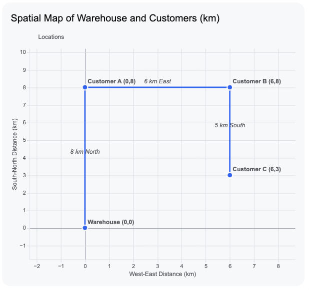
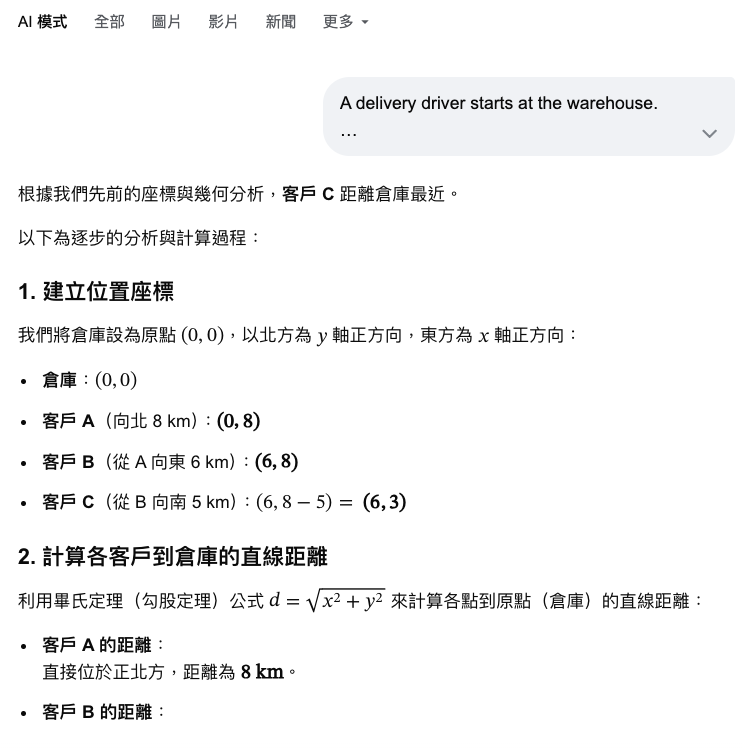
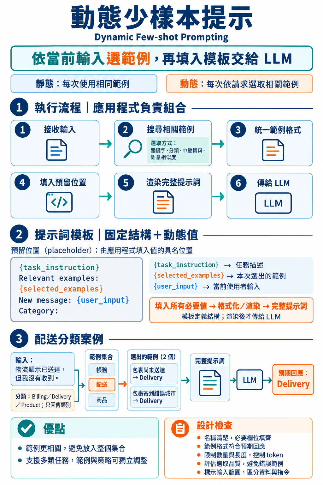
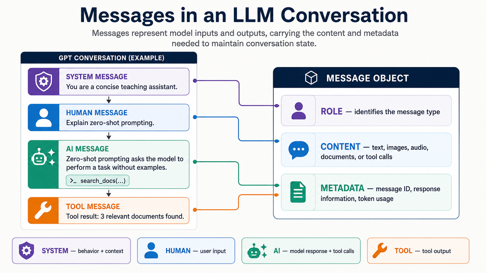

# 提示工程（Prompt Engineering）

## 教學目標

完成本章後，學生應能：

1. 說明提示工程在 LLM 應用程式與 AI Agent 中的用途，並以任務、情境資訊、約束條件與輸出格式組織提示詞。
2. 比較零樣本(zero-shot prompt)、思維鏈(chain-of-though)與少樣本(few-shot prompt)提示的適用情境，並為客戶訊息分類等任務設計提示詞。
3. 區分靜態與動態少樣本提示，說明應用程式如何選取範例、填入預留位置並組成完整提示詞。
4. 辨識 LangChain 的訊息角色、內容與中繼資料，並使用訊息物件、字典或文字字串撰寫模型輸入。
5. 使用 `PromptTemplate` 與 `ChatPromptTemplate` 建立可重複使用的提示詞模板，填入實際資料後傳給模型。
6. 使用 Python 型別提示與 Pydantic model 定義輸出欄位、型態及允許值，並區分必填、可為空值與具有預設值的欄位。
7. 區分提示詞中的 JSON 格式要求與結構化輸出，使用 `with_structured_output()` 取得 Pydantic 物件，並說明資料驗證、錯誤處理與 JSON 序列化的用途。

## 提示工程(Prompt Engineering)簡介

提示工程是開發 LLM 應用程式與 AI Agent 的基礎技術。

它約束模型以產生預期的行為與輸出。

### 什麼是提示工程？

提示工程是設計與調整提示詞的過程，目的是引導及約束 LLM 產生準確、可靠且符合任務需求的回應。

提示詞通常除了以自然語言提問，還會指定以下內容：

- **任務(Task)** – 模型應該做什麼。
- **情境資訊(Context)** – 執行任務所需的背景資訊。
- **約束條件(Constraints)** – 模型應遵守的規則或限制。
- **輸出格式(Output Format)** – 回應應如何組織與呈現。

這些要素能幫助 LLM 更清楚地理解使用者的意圖，並產生更合適的回應。

### 為什麼提示工程很重要？

LLM 的輸出品質很大程度取決於提示詞的品質。

設計良好的提示詞可以：

- 提高回應的準確度。
- 減少幻覺。
- 提高回應的一致性。
- 產生更容易由應用程式處理的輸出。

### AI Agent 中的提示工程

提示工程在 AI Agent 系統中更為重要，因為提示詞不僅定義 Agent **應該做什麼**，也定義它**應該如何行動**。

提示詞可以指定：

- Agent 的角色與目標。
- 應採用的推理策略。
- 使用外部工具的時機與方式。
- 如何與(長短/期)記憶互動。
- 如何與使用者溝通。

本章將介紹幾種提示工程技巧，逐步提升 LLM 的推理能力。

## 提示詞設計(Prompt Design)技巧


### 零樣本提示（Zero-shot Prompting）

Zero-shot Prompting: 只描述任務，不提供任何範例。
- 提示詞只包含任務描述，不提供任何預期輸入或輸出的範例，是最簡單的提示技巧。

特點：

- 只提供任務指令。
- 不提供範例。

**範例 1：資訊擷取**

```
Extract the person's name and email address from the following text.

Text:
Alice Johnson can be reached at alice@example.com for further information.
```

回應

```
Name: Alice Johnson
Email: alice@example.com
```

限制

在以下情況中，零樣本提示可能產生不一致的結果：

* 任務複雜。
* 指令含糊不清。
* 對輸出格式有非常具體的要求。
* 需要多步推理。

**範例 2：複雜任務**

```
A delivery driver starts at the warehouse.

The driver needs to visit three customers.

Customer A is 8 km north of the warehouse.
Customer B is 6 km east of Customer A.
Customer C is 5 km south of Customer B.

Which customer is closest to the warehouse?
```



需要 LLM 進行多步推理，才能正確回答哪個客戶離倉庫最近。

正確回應

```
Customer C is closest to the warehouse.
```


### 思維鏈提示（Chain-of-Thought Prompting）

Chain-of-Thought Prompting: 引導 LLM 將複雜任務分解為一連串中間推理步驟。

- Chain-of-Thought Prompting 引導 LLM 在產生最終答案之前，透過多個中間步驟分析問題。
  - 明確地指示 LLM 先列出推理步驟，再給出最終答案。
  - 常見的提示語：回答前請逐步思考。
- 對於涉及計算、邏輯推理、規劃、比較或多個相依條件的任務，這種技巧特別有用。


**特點**：
- 將複雜問題拆解成較小的步驟。
- 讓推理過程更有系統。
- 強迫 LLM 顯示其推理過程，而不是直接給出答案。
- 降低遺漏重要資訊的風險。
- 改善多步推理任務的表現。
- 產生更容易檢查與驗證的答案。


**範例：多步空間推理**

```
A delivery driver starts at the warehouse.

Customer A is 8 km north of the warehouse.
Customer B is 6 km east of Customer A.
Customer C is 5 km south of Customer B.

Which customer is closest to the warehouse?
Analyze the problem step by step.
```

你以在任一個 GPT 中測試上述提示詞，模型會先列出推理步驟，再給出最終答案。

Google AI 回應



**思維鏈為何有幫助**

直接使用零樣本提示，可能使 LLM 在未仔細處理問題中所有關係的情況下，立即給出答案。

零樣本思維鏈提示會引導模型執行以下步驟，以改善回應：

- 整理已知資訊。
- 依序完成每個推理步驟。
- 檢查中間結果。
- 產生有依據的最終答案。


### 少樣本提示（Few-shot Prompting）

介紹**靜態**與**動態**少樣本提示。

#### 靜態少樣本提示（Static Few-shot Prompting）

Static Few-shot Prompting: 在 prompt 中預先放入一組固定的輸入與輸出範例，讓 LLM 模仿範例中的任務解法、判斷標準與輸出格式。

- 靜態少樣本提示會在實際的使用者輸入之前，提供一組固定的示範範例。
- 每個示範範例通常包含一筆輸入及其預期輸出。
- 無論新的輸入為何，每次請求都會重複使用相同的示範範例。
- 模型從上下文中學習預期的回應模式；模型參數不會更新。

**提示詞結構**

```
Task instruction

Example 1
Input: ...
Output: ...

Example 2
Input: ...
Output: ...

New input: ...
Output:
```

這些範例在上下文中扮演規格的角色。

它們向模型展示如何理解任務，以及合格的答案應該是什麼樣子，通常比逐一用文字描述所有規則更清楚。

**範例：客戶訊息分類**

```
Classify each customer message as Billing, Delivery, or Product.
Return only the category name.

Message: I was charged twice for the same order.
Category: Billing

Message: My package has not arrived yet.
Category: Delivery

Message: Does this keyboard work with a tablet?
Category: Product

Message: The tracking page says my parcel was sent to the wrong city.
Category:
```

預期回應

```
Delivery
```

在這個提示詞中，固定範例同時教導模型分類的定義與要求的輸出格式。

最後一個範例示範回應應只包含一個分類名稱，不附加說明。

**靜態少樣本提示的適用情境**

- 任務的模式或標籤種類少且穩定。
- 輸出格式要求嚴格，或難以精確描述。
- 零樣本指令會導致不一致的解讀。
- 少量具代表性的範例就能涵蓋大部分預期輸入。

**設計原則**

- 使用正確、具代表性且明確的範例。
- 所有示範範例採用一致的格式。
- 納入能區分容易混淆情況的範例。
- 避免不必要的範例，因為每個示範範例都會消耗上下文的 token。
- 確保範例與文字描述的任務指令一致。

**限制**

由於範例是預先選定的，因此不一定與每筆新輸入都有關。靜態範例也會增加提示詞長度，且必須在任務需求改變時手動更新。如果輸入涵蓋的領域廣泛或變化很大，動態選取與當前請求相似的範例可能更有效。

#### 動態少樣本提示（Dynamic Few-shot Prompting）

Dynamic Few-shot Prompting: 根據當前輸入，在執行時從範例集合中選出最相關的範例，再將這些範例放入 prompt template。

動態少樣本提示會依請求選擇示範範例，不會像靜態少樣本提示一樣，每次都使用完全相同的範例。

應用程式會在執行時組合以下內容，建立提示詞：

- 可重複使用的**提示詞模板**。
- 當前的使用者輸入。
- 針對該輸入選出的少量範例。

應用程式可以透過關鍵字比對、分類、中繼資料、語意相似度或其他規則來選取範例。
- 例如，與配送相關的訊息應搭配配送問題的範例，而非無關的帳務範例。

**提示詞模板與預留位置**

提示詞模板是包含預留位置、可重複使用的提示詞結構。**預留位置（placeholder）**是具有名稱的位置，其值由應用程式稍後提供。

```
{task_instruction}

Relevant examples:
{selected_examples}

New message: {user_input}
Category:
```

在這個模板中：

- `{task_instruction}` 會替換為任務描述。
- `{selected_examples}` 會替換為執行時選出的範例。
- `{user_input}` 會替換為當前的客戶訊息。

預留位置將提示詞中固定的部分與會改變的值分開。

模板只定義結構，還不是傳給 LLM 的完整提示詞。

呼叫模型之前，必須將所有必要的預留位置替換為實際值。
- 這個過程通常稱為模板的**格式化（formatting）**或**渲染（rendering）**。

**範例：執行時的值**

假設使用者輸入以下訊息：

```
The courier marked my order as delivered, but I did not receive it.
```

應用程式可以將以下值提供給模板：

```py
task_instruction = "Classify each customer message as Billing, Delivery, or Product. Return only the category name."

selected_examples = """
Message: My parcel has not arrived yet.
Category: Delivery

Message: The tracking page says my parcel was sent to the wrong city.
Category: Delivery
"""

user_input = "The courier marked my order as delivered, but I did not receive it."
```

填入預留位置後，應用程式會將以下渲染完成的提示詞傳給 LLM：

```
Classify each customer message as Billing, Delivery, or Product.
Return only the category name.

Relevant examples:
Message: My parcel has not arrived yet.
Category: Delivery

Message: The tracking page says my parcel was sent to the wrong city.
Category: Delivery

New message: The courier marked my order as delivered, but I did not receive it.
Category:
```

預期回應

```
Delivery
```


**動態少樣本提示的流程**

1. 接收新的使用者輸入。
2. 從範例集合中搜尋相關的示範範例。
3. 將選出的示範範例整理為一致的格式。
4. 將任務、範例與使用者輸入指定給對應的預留位置。
5. 渲染提示詞模板。
6. 將完整的提示詞傳給 LLM。

從概念上來看，應用程式會執行以下操作：

```python
selected_examples = select_examples(user_input)

prompt = prompt_template.format(
    task_instruction=task_instruction,
    selected_examples=selected_examples,
    user_input=user_input
)

response = llm.invoke(prompt)
```

**優點**

- 提供與當前輸入更相關的範例。
- 避免在每個提示詞中放入整個範例集合。
- 支援包含多種分類、領域或輸入模式的任務。
- 範例集合與選取策略可以獨立於模板持續調整。

**設計考量**

- 使用清楚且能表達用途的預留位置名稱。
- 呼叫 LLM 前，確保所有必要的預留位置都已填入值。
- 選出的範例應採用與預期回應一致的格式。
- 限制範例的數量與長度，以控制 token 用量。
- 評估範例選取策略，因為無關或錯誤的範例可能降低回應品質。
- 清楚標示使用者提供內容的範圍，讓模型將其視為輸入資料，而非額外指令。



### 提示 LLM 輸出特定格式（Formatted LLM Output Prompting）

Formatted LLM Output Prompting: 在 prompt 中明確指定 LLM 的輸出格式，讓回應可以被應用程式穩定地讀取與處理。

**JSON（JavaScript Object Notation）** 是一種常見的輸出格式。
- JSON 回應以鍵值對表示資料。LLM 會回傳預先定義的欄位，供應用程式解析，而不是回傳非結構化的自然語言答案。

**範例：要求 JSON 輸出**

```
Classify the following customer message as Billing, Delivery, or Product.

Customer message:
The courier marked my order as delivered, but I did not receive it.

Return the result as valid JSON using the following fields:
- "category": a string containing the category name
- "reason": a short string explaining the classification

Return only the JSON object without Markdown or additional text.
```

預期回應

```json
{
  "category": "Delivery",
  "reason": "The customer did not receive an order marked as delivered."
}
```

提示詞同時定義欄位名稱與預期的值型態。它也要求模型只回傳 JSON 物件，避免額外的說明文字干擾 JSON 解析。

**設計原則**

- 清楚指定每個必要的 JSON 欄位。
- 描述預期的資料型態，例如字串、數字、布林值、陣列或物件。
- 若欄位只有有限的選項，應列出允許值。
- 要求輸出合法的 JSON，屬性名稱與字串值皆使用雙引號。
- 指示模型不要加入 Markdown 程式碼界限符(```)或額外文字。

## 支援提示工程的 LangChain API

### 訊息（Messages）

什麼是訊息？
- 訊息代表對話過程中的人工訊息(Human Message)、模型回應(AI Message)或工具呼叫的輸出(Tool Message)。

訊息物件包含以下內容：
- **角色（Role）**：識別訊息類型，例如 system、user。
- **內容（Content）**：訊息的實際內容，例如文字、圖片、音訊、文件等。
- **中繼資料（Metadata）**：選填欄位，例如回應資訊、訊息 ID 與 token 用量。

### 訊息類型

 - 系統訊息（System message）- 告訴模型應如何行動，並提供互動所需的情境資訊。
 - 使用者訊息（Human message）- 代表使用者的輸入及其與模型的互動。
 - AI 訊息（AI message）- 模型產生的回應，包含文字內容、工具呼叫(Tool Calls)與中繼資料(meta-data)。
   - meta-data: LLM 供應商提供的回應資訊，例如模型名稱、停止原因或 token 使用量。
 - 工具訊息（Tool message）- 代表工具呼叫的輸出。



### 在 LangChain 中使用訊息物件

這些訊息類型都由 `langchain.messages` 模組提供。

建立訊息物件的寫法如下：

```python
from langchain.messages import SystemMessage, HumanMessage, AIMessage

# Create a system message
system_msg = SystemMessage("You are a helpful assistant.")
# Create a human message
human_msg = HumanMessage("What is the weather like today?")
# Create an AI message
ai_msg = AIMessage("The weather is sunny and warm.")
```

- 每個訊息建構子的第一個參數都是訊息內容(content)。
- 訊息的角色由建立該訊息所使用的類別決定。

API 資訊:
- [AIMessage](https://reference.langchain.com/python/langchain-core/messages/ai/AIMessage)
- [HumanMessage](https://reference.langchain.com/python/langchain-core/messages/human/HumanMessage)
- [SystemMessage](https://reference.langchain.com/python/langchain-core/messages/system/SystemMessage)
- [ToolMessage](https://reference.langchain.com/python/langchain-core/messages/tool/ToolMessage)

### 建立包含中繼資料的訊息 (Optional)

**metadata 的用途**

除了訊息的主要內容（`content`）之外，LangChain 的 message object 也可以保存 metadata。

Metadata 不屬於使用者實際輸入的文字，而是用來描述、辨識或追蹤這則訊息的附加資訊。

常見用途包括：

- 使用 `name` 識別訊息的發送者，特別適合多人或多個 agent 參與的對話。
- 使用 `id` 為訊息指定唯一識別碼，方便記錄、追蹤及除錯。
- 使用 `additional_kwargs` 保存供特定模型供應商或應用程式使用的額外資料。
  - 例如，`{"source": "email", "priority": "high"}` 可以標記訊息來源與優先級。
- 使用 `response_metadata` 保存模型回應的相關資訊，例如模型名稱、停止原因或 token 使用量。這類資料通常出現在 `AIMessage` 中。
  - 由 LLM 供應商提供的回應 metadata 可以幫助開發者分析模型行為、追蹤成本或改善 prompt 設計。

Metadata 與 `content` 分開儲存，因此應用程式可以在不修改訊息正文的情況下，利用這些欄位管理對話狀態或追蹤訊息來源。

**範例：在 HumanMessage 中添加 metadata**

```py
human_msg = HumanMessage(
    content="Hello!",
    name="alice",  # Optional: identify different users
    id="msg_123",  # Optional: unique identifier for tracing
    additional_kwargs={"source": "email", "priority": "high"}  # Optional: extra metadata
)

print(human_msg.content)                    # Hello!
print(human_msg.name)                       # alice
print(human_msg.id)                         # msg_123
print(human_msg.additional_kwargs)          # {'source': 'email', 'priority': 'high'}
```

在這個例子中，模型要處理的主要訊息仍是 `Hello!`；`name`、`id` 與 `additional_kwargs` 則提供應用程式管理這則訊息時所需的額外資訊。

Check the demo in [prompt_engineering.ipynb](notebooks/prompt-engineer-tool-calls/prompt_engineering.ipynb) in the course-demo repository.

### 撰寫訊息提示詞

我們需要撰寫提示詞，才能與 LLM 互動。

多輪對話開始時，提示詞通常包含：
- System Message: 定義模型角色與行為的系統訊息。
- Human Message: 提供使用者輸入或請求的使用者訊息。

因此，我們會將訊息列表(list of messages)傳給模型:

```python
messages = [
    SystemMessage(content="You are a helpful assistant."),
    HumanMessage(content="What is the weather like today?")
]
response = model.invoke(messages)
```

撰寫訊息提示詞時，使用 Python 的 list 語法建立訊息物件列表。

每個訊息物件可以是 `SystemMessage`、`HumanMessage` 或 `AIMessage`。

**範例：客戶訊息分類的訊息提示詞**

```python
from langchain.chat_models import init_chat_model
from langchain.messages import SystemMessage, HumanMessage

messages = [
    SystemMessage(
        content=(
            "You classify customer messages as Billing, Delivery, or Product. "
            "Return only the category name."
        )
    ),
    HumanMessage(
        content="The courier marked my order as delivered, but I did not receive it."
    )
]

model = init_chat_model("gpt-5-nano")
response = model.invoke(messages)
```

在這個訊息提示詞中：

- `SystemMessage` 定義模型角色、分類規則與預期的輸出格式。
- `HumanMessage` 包含客戶當前的訊息。
- `messages` 列表會作為一個提示詞傳給聊天模型。

預期回應

```
Delivery
```

response 為一個 AIMessage 物件，包含模型的回應內容與中繼資料:

```
AIMessage(content='Delivery', additional_kwargs={'refusal': None}, 
response_metadata={'token_usage': {'completion_tokens': 74, 'prompt_tokens': 43, 'total_tokens': 117, ...})
```


### 訊息提示詞的字典格式

撰寫簡短、輕量的程式碼時，使用訊息物件類別可能顯得較為冗長。
- 因為要匯入相關的訊息類別

LangChain 也允許使用較精簡的字典格式撰寫訊息提示詞。

每則訊息以字典表示，包含 `role` 與 `content` 兩個鍵。`role` 可以是 `"system"`、`"user"` 或 `"assistant"`。

範例：與前述訊息提示詞等效的字典格式

```python
messages = [
    {"role": "system", "content": (
        "You classify customer messages as Billing, Delivery, or Product. "
        "Return only the category name."
    )},
    {"role": "user", "content": (
        "The courier marked my order as delivered, but I did not receive it."
    )}
]
model = init_chat_model("gpt-5-nano")
response = model.invoke(messages)
```

### 文字提示詞(Text Prompt)

當你有以下需求時：
* 只有一個獨立的請求。
* 不需要對話歷史。
* 希望程式碼盡量簡單。

可以直接撰寫提示詞(字串)，不使用訊息物件或字典格式：

```py
response = model.invoke("The courier marked my order as delivered, but I did not receive it. Classify this message as Billing, Delivery, or Product.")
```

## 提示詞模板(Prompt Template)

透過預留位置重複使用提示詞結構

### 什麼是提示詞模板？

當反覆執行相同任務，但提示詞內容的部份內容會改變時，使用提示詞模板可以減少程式碼重複。


例如，先前的的動態少樣本提示應用程式，必須在每次請求時組合任務指令、選出的範例與當前的客戶訊息。
- 如果每次都手動重新建立完整的訊息列表，程式碼會重複。

以下情況適合使用提示詞模板：

- 相同的提示詞結構需要搭配不同的輸入值重複使用。
- 系統指令與輸出規則應保持一致。
- 必須將執行時的資料插入提示詞，例如客戶訊息、產品名稱或檢索取得的情境資訊。
- 希望將提示詞的建立與模型呼叫分開處理。

### 提示詞模板的運作方式

使用字串模板或訊息（訊息物件列表）定義提示詞模板。

將每次請求會改變的部分保留為**預留位置(Placeholder)**。
- 預留位置是模板中具有名稱的位置，其值由應用程式稍後提供。

使用模板物件的 `invoke()` 方法，將實際值填入預留位置，產生完整的提示詞。

可以在 invoke 之前完成模版的格式化，如:

```python
prompt_template = PROMPT_TEMPLATE.format(
    task_instruction=task_instruction,
    selected_examples=selected_examples,
    user_input=user_input
)
response = llm.invoke(prompt_template)
```

這是使用 Python 的字串格式化方法，將實際值填入模板。


第二種方式，在 invoke 時直接傳入一個字典，將實際值與預留位置名稱對應起來, 虛擬碼如下：

```python
prompt_template = PromptTemplate(template_structure_with_placeholders)
prompt = prompt_template.invoke({
    "placeholder_name_1": value_1,
    "placeholder_name_2": value_2,
    ...
})
response = llm.invoke(prompt)
```

但這種寫法需要使用到 `LangChain` 的 `PromptTemplate` 或 `ChatPromptTemplate` 類別，才能這樣做。

我們以下對 `PromptTemplate` 及 `ChatPromptTemplate` 做進一步的介紹。

### 提示詞模板的類型

- `PromptTemplate` - 以包含預留位置的字串模板，定義可重複使用的提示詞結構。
  - 適用於交談過程中不需要區分 system、user 與 assistant 訊息角色的情況。

- `ChatPromptTemplate` - 以包含預留位置的**訊息物件列表(list of messages)**，定義可重複使用的提示詞結構。
  - 適用於需要進行多輪對話，並且需要區分 system、user 與 assistant 訊息角色的情況。


## PromptTemplate 物件

### 從 f-string 模板建立 PromptTemplate

[`PromptTemplate` 類別](https://reference.langchain.com/python/langchain-core/prompts/prompt/PromptTemplate) 用來建立可重複使用的提示詞結構，使用以包含預留位置的**字串模板(f-string)** 來建立。
- 適合模型不需要區分 system、user 與 assistant 訊息的單輪提示詞。

當 prompt 的內的比較長時，使用 f-string 撰寫 prompt template 會比較方便。

使用 `PromptTemplate.from_template()` 方法，將 f-string 模板轉換為 PromptTemplate 物件。

**範例：使用動態少樣本提示進行客戶訊息分類**

使用前個章節的 Dynamic Few-shot Prompting 範例，為其建立一個 `PromptTemplate` 物件。

先定義一個 f-string 模板，將 task instruction、selected examples 與 user input 設為 placeholder:

```python
# f-string template for Dynamic Few-shot Prompting
prompt_template_str = """
  {task_instruction}
  Relevant examples:
  {selected_examples}
  New message: {user_input}
  Category:
"""
```

接著建立一個 `PromptTemplate` 物件，從 f-string 模板中讀取 prompt 結構與 placeholder:

```python
from langchain_core.prompts import PromptTemplate
# Create a PromptTemplate from the f-string template
prompt_template = PromptTemplate.from_template(prompt_template_str)
```

`PromptTemplate` 提供 `invoke()`， 用來將實際的值填入 placeholder，產生完整的 prompt:

```python
# Define the runtime values for the placeholders
task_instruction = "Classify each customer message as Billing, Delivery, or Product. Return only the category name."

selected_examples = """
Message: My parcel has not arrived yet.
Category: Delivery

Message: The tracking page says my parcel was sent to the wrong city.
Category: Delivery
"""

user_input = "The courier marked my order as delivered, but I did not receive it."
# Assign values to placeholders and render the prompt
prompt = prompt_template.invoke({
    "task_instruction": task_instruction,
    "selected_examples": selected_examples,
    "user_input": user_input
})

# View the rendered prompt
from pprint import pprint
pprint(prompt)
```

預期輸出

```
StringPromptValue(text='\n  Classify each customer message as Billing, Delivery, or Product. Return only the category name.\n  Relevant examples:\n  \nMessage: My parcel has not arrived yet.\nCategory: Delivery\n\nMessage: The tracking page says my parcel was sent to the wrong city.\nCategory: Delivery\n\n  New message: The courier marked my order as delivered, but I did not receive it.\n  Category:\n')
```

## ChatPromptTemplate 物件

### 何時使用 ChatPromptTemplate

[`ChatPromptTemplate` 類別](https://reference.langchain.com/python/langchain-core/prompts/chat/ChatPromptTemplate) 用來建立可重複使用的提示詞結構，結構以包含預留位置的**訊息物件列表**定義。

當提示詞包含多則不同角色（system、user、assistant）的訊息，且需要以不同輸入值重複使用相同結構時，適合使用 `ChatPromptTemplate`。

### 從訊息物件列表建立 ChatPromptTemplate

當一次要建立多個角色的訊息時，使用 `ChatPromptTemplate.from_messages()` 方法, 將一個包含多個訊息物件的列表轉換為 `ChatPromptTemplate` 物件。

注意 message list 中的單一 message 的寫法，不是使用 `SystemMessage`、`HumanMessage` 或 `AIMessage` 物件，而是使用 2-tuple of `(message_type, template)`.

### 範例：使用動態少樣本提示進行客戶訊息分類

以先前的 Dynamic Few-shot Prompting 範例為例， message list 的寫法：

```python
messages_template = [
    ("system", "You classify customer messages as Billing, Delivery, or Product. Return only the category name."),
    ("user", "Relevant examples:\n{selected_examples}"),
    ("user", "New message: {user_input}\nCategory:")
]
```

注意，使用 tuples 而不是 dict 的方式撰寫單一個 message. 

`ChatPromptTemplate` 會自動將 tuple 轉換為對應的 message object。

接著，使用 `ChatPromptTemplate.from_messages()` 方法，將 message list 轉換為 `ChatPromptTemplate` 物件:

```python
from langchain_core.prompts import ChatPromptTemplate
# Create a ChatPromptTemplate from the message list
chat_prompt_template = ChatPromptTemplate.from_messages(messages_template)
```

再使用該物件的 `invoke()` 方法，將實際的值填入 placeholder，產生完整的 prompt:

```python
# Assign values to placeholders and render the prompt
prompt = chat_prompt_template.invoke({
    "selected_examples": selected_examples,
    "user_input": user_input
})
```

使用 dict 描述的 placeholder 的名稱與值，以填入 template 中。

查看渲染後的 prompt:

```python
# View the rendered prompt
pprint(prompt)
``` 

預期輸出

```
ChatPromptValue(messages=[SystemMessage(content='You classify customer messages as Billing, Delivery, or Product. Return only the category name.', additional_kwargs={}, response_metadata={}), HumanMessage(content='Relevant examples:\n\nMessage: My parcel has not arrived yet.\nCategory: Delivery\n\nMessage: The tracking page says my parcel was sent to the wrong city.\nCategory: Delivery\n', additional_kwargs={}, response_metadata={}), HumanMessage(content='New message: The courier marked my order as delivered, but I did not receive it.\nCategory:', additional_kwargs={}, response_metadata={})])
```

### 補充 Q: 可以使用 SystemMessage、HumanMessage 與 AIMessage 物件來建立 ChatPromptTemplate 嗎？

SystemMessage、HumanMessage 與 AIMessage 皆屬於 `BaseMessage` 的子類別。
可使用這些 `BaseMessage` 來建立 chat prompt template，但是， `BaseMessage` 不支援 `placeholder`。

如果希望在 `BaseMessage` 中使用 placeholder，需要改用 `BaseMessagePromptTemplate` 的子類別，分別是 `SystemMessagePromptTemplate`、`HumanMessagePromptTemplate` 與 `AIMessagePromptTemplate`。

有興趣的讀者可以參考 LangChain 官方文件. 

## 強迫 JSON 格式輸出: 結構化輸出(Structured Output)

### 為何要強迫 LLM 產生 JSON 格式輸出？

一般的 LLM 回應是自然語言。即使在 prompt 中要求模型回傳 JSON，模型仍可能加入說明文字、遺漏欄位、使用錯誤的資料型態，或產生不合法的 JSON。

當模型的輸出需要交給其他程式處理時，應該使用結構化輸出。例如：

- 根據分類結果將 customer message 轉交給不同部門。
- 將分類結果寫入資料庫。
- 呼叫下一個 API 或 agent。
- 檢查必要欄位、資料型態及允許值是否正確。

LangChain 的 [`with_structured_output()`](https://docs.langchain.com/oss/python/langchain/models#structured-output) 可以將輸出 schema 綁定到 chat model。模型必須依照 schema 產生結果，LangChain 再將結果解析成對應的 Python object。

其運作流程為：

1. 使用 Pydantic model 或 TypedDict 定義輸出欄位、資料型態與限制。
2. 使用 `with_structured_output()` 將 schema 綁定到 chat model。
3. 將 customer message 傳給支援 structured output 的 model。
4. LangChain 將模型輸出解析並驗證為 Pydantic object 或 dict。
5. 應用程式將輸出 object 轉換成 JSON。

這種方式不是只在 prompt 中加入「Return JSON」指令，而是透過模型供應商支援的 structured-output 或 tool-calling 機制約束輸出。

### 使用 pydantic model 定義輸出格式(schema)

以下 schema 定義 customer message classification 的輸出格式，格式中有 兩個欄位：`category` 與 `reason`。
- `category` 是一個字串，且只能是 `"Billing"`、`"Delivery"` 或 `"Product"`。
- `reason` 是一個字串，用來保存簡短的分類理由。

```python
from typing import Literal
from pydantic import BaseModel, Field

class CustomerMessageClassification(BaseModel):
    """The classification result for a customer message."""

    category: Literal["Billing", "Delivery", "Product"] = Field(
        description="The category assigned to the customer message."
    )
    reason: str = Field(
        description="A short explanation for the classification."
    )
```

程式碼說明：

- `CustomerMessageClassification` 繼承 `BaseModel`，代表一筆分類結果。
- `category` 使用 `Literal`，限制模型只能產生 `"Billing"`、`"Delivery"` 或 `"Product"`。
- `reason` 必須是字串，用來保存簡短的分類理由。
- `Field(description=...)` 說明每個欄位的意義，協助模型產生正確內容。
- 如果輸出缺少必要欄位、欄位型態錯誤，或 `category` 不在允許值中，Pydantic validation 就不會通過。

此 Pydantic model 同時扮演兩個角色：它是提供給模型的輸出 schema，也是應用程式驗證回應的規則。

注意： `Field` 的 `description` 參數是提供給模型的提示，要確實描述欄位的意義與限制，LLM 會使用這些描述來分析輸出的內容，並將之轉換成對應的欄位。

### 要求 LLM 產生結構化輸出

先建立一般的 chat model，再呼叫 `with_structured_output()`，指定輸出 schema 為 `CustomerMessageClassification`：

```python
from langchain.chat_models import init_chat_model

model = init_chat_model("gpt-5-nano")

structured_model = model.with_structured_output(
    CustomerMessageClassification
)
```

接著，使用相同的 customer message classification 例子呼叫 `structured_model`：

```python
messages = [
    {
        "role": "system",
        "content": (
            "Classify each customer message as Billing, Delivery, or Product. "
            "Provide a short reason for the classification."
        )
    },
    {
        "role": "user",
        "content": (
            "The courier marked my order as delivered, "
            "but I did not receive it."
        )
    }
]

response = structured_model.invoke(messages)
```

輸出的結果 `response` 是一個 `CustomerMessageClassification` object，已經通過 Pydantic validation。

可使用 `response.category` 與 `response.reason` 取得欄位值，或使用 `response.model_dump_json()` 將 Pydantic object 轉換成 JSON string。

```python
print(response.category)  # Delivery
print(response.reason)    # The order is marked as delivered, but the customer did not receive it.
print(response.model_dump_json())
```


```json
{
  "category": "Delivery",
  "reason": "The order is marked as delivered, but the customer did not receive it."
}
```


