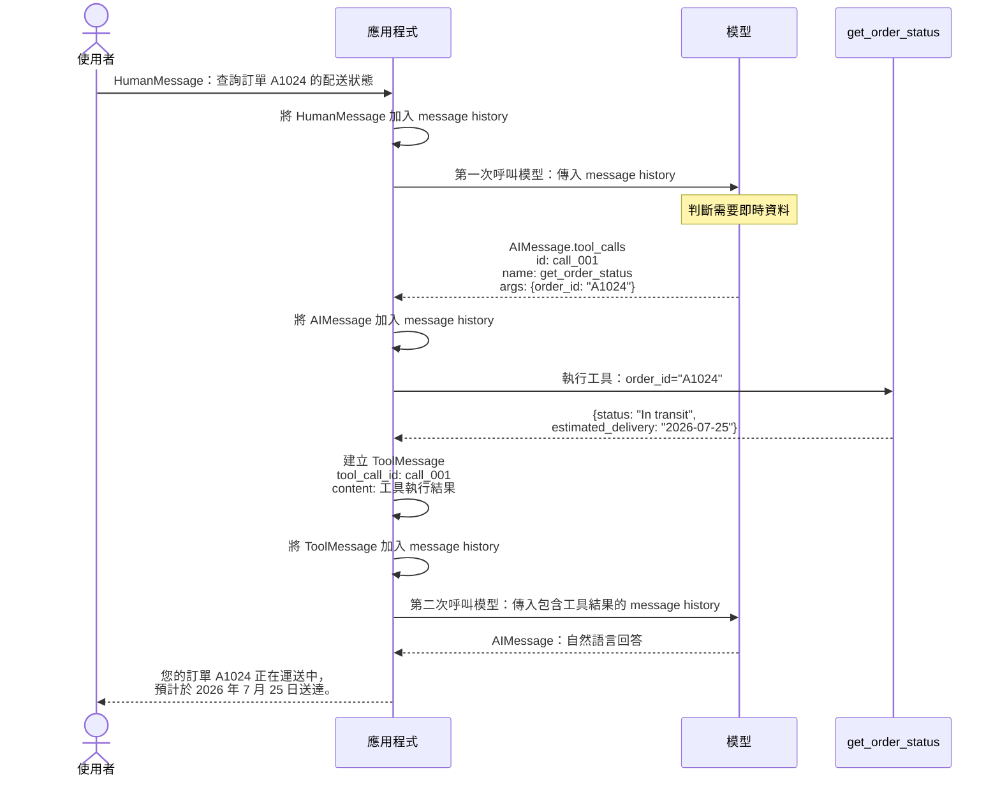
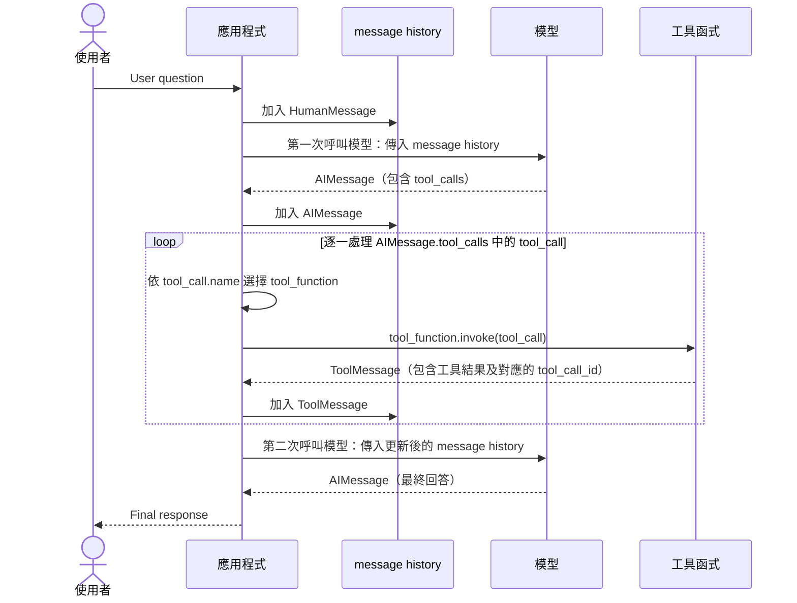

# 工具呼叫（Tool Calling）

## 教學目標

完成章後，學生應能：

1. **說明工具呼叫的用途與責任分工**：解釋工具如何擴充模型能力，區分模型提出工具呼叫請求、應用程式執行工具，以及模型依結果回答的角色。
2. **定義並綁定工具**：使用型別註記、docstring 與 `@tool` 定義工具，並透過 `bind_tools()` 將工具綁定至聊天模型。
3. **設計工具使用的系統提示詞**：明確規範工具使用時機、參數來源、缺少資訊與查無資料的處理方式，以及依據工具結果回答的原則。
4. **解讀工具呼叫請求與結果**：辨識 `AIMessage.tool_calls` 中的 `name`、`args`、`id` 與 `type`，並說明 `ToolMessage.tool_call_id` 如何對應原始請求。
5. **實作工具執行迴圈**：依序完成模型呼叫、工具選擇與執行、訊息歷史更新，以及再次呼叫模型產生最終回答。
6. **使用 LangChain Agent 完成訂單查詢**：說明 Model 與 Harness 的分工，使用 `create_agent()` 建立 Agent，傳入含有 `messages` 的 State，並從回傳結果取得最終回答。

## 什麼是工具？

工具擴充了聊天模型的能力，讓模型能取得即時資料、執行程式碼、查詢外部資料庫，以及採取實際行動。

工具是提供給聊天模型的**可呼叫函數 (callable function)**，具有明確定義的輸入與輸出。

模型會根據對話上下文，決定何時呼叫工具，以及提供哪些輸入參數。


## LLM 呼叫工具的程序

事前準備:
1. 定義工具函數及其輸入與輸出型別。
   - 提供工具用途與功能的說明。
2. 撰寫系統提示詞(System Prompt)，說明何時使用工具，以及使用工具的目的。
3. 向聊天模型註冊工具函數。

執行流程:
1. 輸入系統提示詞與使用者輸入至 LLM (第一次呼叫模型)。 
2. LLM 判斷是否需要使用工具，若需要則回傳 AIMessage，其中包含一個或多個工具呼叫請求 (tool call request)。
3. 應用程式依工具呼叫(tool call)所提供的參數執行相對應的工具函數。
4. 工具函數執行結被後，產生一個 `ToolMessage` 物件，其中包含函數的輸出結果。
5. `ToolMessage` 被加入訊息歷史(historical messages)。
6. LLM 使用更新後的訊息歷史產生最終回答(第二次呼叫模型)。

所以，至少需要二次的模型呼叫: 
- 第一次呼叫模型產生工具呼叫請求
- 第二次呼叫模型產生最終回答

完整的 Tool Calling 流程如下：



## 定義工具函數

### 如何定義工具函數？

工具函數是可呼叫的函數，接收輸入參數並回傳輸出結果。

定義函數時，函數的註解扮演著重要的角色，因為 Chat-Model 會使用函數的註解來理解函數的用途和功能，並決定何時以及如何調用該函數。
- 預設情況下，函數的文件字串（docstring）會成為工具的描述，協助模型理解何時使用工具。

此外，使用 `@tool` 裝飾器將一般函數包裝成 [`StructuredTool` 物件](https://reference.langchain.com/python/langchain-core/tools/structured/StructuredTool)，以便在 LLM 模型中使用。


工具函數的寫法如下：

```python
from langchain.tools import tool

@tool
def tool_function_name(input_arg1: type, input_arg2: type, ...) -> return
"""
    Tool function description.
    Args:
        input_arg1 (type): Description of input_arg1.
        input_arg2 (type): Description of input_arg2.
        ...
    
    Returns:
        return: Description of the return value.
    
    """
    # Function implementation
    ... 
```

### 範例：取得訂單狀態的工具函數

定義一個工具函數，根據提供的訂單 ID 取得客戶的訂單狀態。
- 此函數接收字串輸入（訂單 ID），並回傳字串輸出（訂單狀態）。

此函數以模擬方式呈現從資料庫或外部服務取得訂單狀態的過程。
為了示範，我們使用字典來表示訂單狀態。

工具函數定義如下：

```python
from langchain.tools import tool

@tool
def get_order_status(order_id: str) -> dict:
    """
    Retrieves the status of a customer's order based on the provided order ID.

    Args:
        order_id (str): The unique identifier for the customer's order.
    
    Returns:
        dict: A dictionary containing the order status and estimated delivery date.
    """

    # Mocked order status data for demonstration purposes
    # 模擬的訂單狀態資料，用於示範
    orders = {
        "A1024": {
            "status": "Shipped",
            "estimated_delivery": "2023-07-25"
        },
        "B2048": {
            "status": "Processing",
            "estimated_delivery": "2023-07-30"
        },
        "C4096": {
            "status": "Delivered",
            "estimated_delivery": "2023-07-20"   
        }
    }

    # 查詢訂單狀態，若找不到則回傳預設訊息
    status = orders.get(order_id, {"status": "Order ID not found", "estimated_delivery": None })
    return status
```

## 建立聊天模型(chat model)並綁定工具函數

### 建立聊天模型實例

```python
from langchain.chat_models import init_chat_model

chat_model = init_chat_model("gpt-5-nano")
```

### 將工具函數綁定至聊天模型

`init_chat_model` 會回傳 `BaseChatModel` 物件。

使用其 [`bind_tools` 方法](https://reference.langchain.com/python/langchain-core/language_models/chat_models/BaseChatModel/bind_tools)，將工具函數綁定至聊天模型。
- 將一個或多個工具函數放入列表，再傳入 `bind_tools` 方法。

`bind_tools` 不會修改原物件，而是回傳一個已綁定工具函數的新 `BaseChatModel` 物件。

```python
# A list of tool functions 
tools = [get_order_status]
# Return a new BaseChatModel object with the tool function bound to it.
model_with_tools = chat_model.bind_tools(tools)
```

參考 [模型 — LangChain 文件](https://docs.langchain.com/oss/python/langchain/models#tool-calling)


完整的程式碼範例如下：

```python
from langchain.chat_models import init_chat_model

chat_model = init_chat_model("gpt-5-nano")
tools = [get_order_status]
model_with_tools = chat_model.bind_tools(tools)
```

## 設計系統提示詞

必須在 system prompt 中描述何時使用工具函數以及如何使用它。這樣，模型才能根據對話上下文決定何時調用工具函數以及提供哪些輸入參數。

> Prompt 的設計重點：明確規範工具的使用時機、參數來源，以及如何根據結果回答。

以下是電商客服助理的系統提示詞：

```python
system_prompt = """
You are an e-commerce customer service assistant.

Your responsibilities:
- Help customers with questions about their orders.
- When a customer asks about an order's current status, use the
  `get_order_status` tool.
- Extract the order ID from the customer's message and pass it to the
  `order_id` argument exactly as provided.
- If the customer does not provide an order ID, ask for it before calling
  the tool.
- Base your answer on the tool result. Do not guess or fabricate an order
  status.
- If the tool returns the status "Order ID not found", tell the customer that the
  order ID could not be found and ask them to verify it.
- Do not call the tool for questions unrelated to order status.
- Respond politely and concisely in the same language used by the customer.
"""
```

| 設計重點 | Prompt 中的具體安排 |
|---|---|
| **角色與任務** | 定義為電商客服助理，協助處理訂單問題。 |
| **工具觸發條件** | 客戶詢問訂單目前狀態時，使用 `get_order_status`；無關問題不呼叫。 |
| **參數擷取規則** | 從客戶訊息取得訂單編號，原樣傳入 `order_id`，避免自行修改。 |
| **缺少資訊的處理** | 未提供訂單編號時，先詢問，補齊資訊後才呼叫工具。 |
| **回答的依據** | 根據工具結果回答，不猜測或捏造訂單狀態。 |
| **查無資料的處理** | 收到 `"Order ID not found"` 時，告知查無編號並請客戶確認。 |
| **回覆風格** | 使用客戶的語言，保持禮貌與簡潔。 |

## 工具執行迴圈（Tool Execution Loop）

聊天模型決定使用工具時，**不會**自行執行 Python 函數。

它會回傳一個 `AIMessage`，其中包含一個或多個工具呼叫請求。

**應用程式**負責執行請求的工具，並將回傳的 `ToolMessage` 加入訊息歷史，之後再次呼叫模型以產生最終回答。

在這個基礎範例中，工具執行迴圈是指一次完整的 `Model → Tool → Model` 循環：

<!-- ```text
User question
      ↓
Invoke the model
      ↓
Append the resultant AIMessage to the message history
      ↓
Iterate over all tool calls in the AIMessage
      ↓
    Execute each requested tool
    (use tool_function.invoke(tool_call) to execute the tool)
      ↓
    Append each ToolMessage to the message history
      ↓
Invoke the model again
      ↓
Final response
``` -->




參考: [工具執行迴圈](https://docs.langchain.com/oss/python/langchain/models#tool-execution-loop)

### 建立訊息歷史並呼叫模型

```python
from langchain.messages import HumanMessage, SystemMessage

messages = [
    SystemMessage(content=system_prompt),
    HumanMessage(content="我的訂單 A1024 現在送到哪裡了？什麼時候會到？"),
]

# Step 1: The model generates a tool-call request.
ai_message = model_with_tools.invoke(messages)
# Append the AIMessage to the message history
messages.append(ai_message)
```

### 工具呼叫請求

工具呼叫請求是模型判斷需要使用已綁定的工具後，產生的結構化指令。它會指定**應用程式應執行哪個工具**，以及**應傳入哪些參數**。

此請求儲存在回傳的 `AIMessage` 的 `tool_calls` 屬性中：

```python
print(ai_message.tool_calls)
```

`ai_message.tool_calls` 是一個 tool call 列表，因為模型可能在單次回應中提出多個工具呼叫請求。

一個 tool call 包含以下欄位：

| 欄位 | 說明 |
|---|---|
| `name` | 模型請求執行的工具名稱。 |
| `args` | 包含工具參數名稱與值的字典。 |
| `id` | 此請求的唯一識別碼。對應的 `ToolMessage` 會使用此值作為其 `tool_call_id`。 |
| `type` | 結構化請求的類型。工具呼叫的值為 `tool_call`。 |

針對客戶的問題，模型會產生以下請求：

```python
[{'args': {'order_id': 'A1024'},
  'id': 'call_FTka77DlSYLy354DlDpuje4Q',
  'name': 'get_order_status',
  'type': 'tool_call'}]
```

此請求的意思是：

- 選擇名稱為 `get_order_status` 的工具。
- 將 `A1024` 傳入其 `order_id` 參數。
- 使用 `call_FTka77DlSYLy354DlDpuje4Q`，將後續的工具結果與此請求關聯起來。

此時，模型只是**提出**工具呼叫請求。`get_order_status` Python 函數尚未執行，這個結構也不包含訂單狀態。

應用程式必須檢查請求、執行對應的工具，並將回傳的 `ToolMessage` 加入訊息歷史。

### 逐一處理工具呼叫並執行請求的工具

建立一個字典，將工具名稱對應到 `StructuredTool` 物件。
- 工具名稱為 key 
- `StructuredTool` 物件為 value
- 方便在迴圈中，依工具名稱查找對應的工具函數，並執行工具函數的 `invoke()` 方法，以執行函數並回傳 [`ToolMessage`](https://docs.langchain.com/oss/python/langchain/messages#tool-message)。

```python
# 先前 tools = [get_order_status]
tools_by_name = {tool.name: tool for tool in tools}
```

在 dict 中：
- key 是 tool function 的名稱，
- value 是 LangChain 的 [`StructuredTool` 物件](https://reference.langchain.com/python/langchain-core/tools/structured/StructuredTool).

接著，逐一走訪(Iterate) `AIMessage` 中的工具呼叫列表，並執行各個請求的工具。

```python
for tool_call in ai_message.tool_calls:
    selected_tool = tools_by_name.get(tool_call.get("name"))
    if selected_tool:
        # 使用 StructuredTool.invoke() 執行工具，並將回傳的 ToolMessage 加入訊息歷史
        tool_message = selected_tool.invoke(tool_call)
        messages.append(tool_message)
```

工具函數回傳的 `ToolMessage` 範例如下：

```
ToolMessage(content='{"status": "Shipped", "estimated_delivery": "2023-07-25"}', name='get_order_status', tool_call_id='call_FTka77DlSYLy354DlDpuje4Q')]
```

 重點：
 - 呼叫 `get_order_status.invoke(tool_call)` 會執行函數，並回傳 `ToolMessage`。
 - 工具訊息的 `tool_call_id` 與原始工具呼叫中的 `id` 相同，讓模型能將結果與正確的請求關聯起來。

訊息順序很重要：

1. `HumanMessage` 包含使用者的問題。
2. 第一個 `AIMessage` 記錄模型的工具呼叫請求。
3. `ToolMessage` 記錄應用程式回傳的結果。
4. 最後的 `AIMessage` 使用該結果回答使用者。

請勿省略第一個 `AIMessage`，或只加入函數的原始結果。
- 模型需要在對話歷史中同時取得工具呼叫請求及其對應的 `ToolMessage`。


### 再次呼叫模型以取得最終回答

使用更新後的訊息歷史再次呼叫模型，取得最終回答。

```python
final_response = model_with_tools.invoke(messages)
print(final_response.content)
```

```
您的訂單 A1024 已出貨，現在正配送中，預計於 2023-07-25 送達。如需追蹤連結或查詢最新動態，告訴我，我可以幫您提供。
```

針對這個輸入，第一次呼叫模型時應產生 `get_order_status(order_id="A1024")` 的呼叫請求。


## 使用 LangChain 的 Agent 類別呼叫工具

前面我們以手動方式執行工具執行迴圈。

在實際應用中，可以使用 LangChain 的 `Agent` 類別自動處理工具執行迴圈。

### LangChain 的 Agent 類別

在 LangChain 中，Agent 是一個能夠反覆呼叫工具，直到完成指定任務的語言模型系統。

一般 LLM 只會根據輸入產生一次輸出；Agent 則可以自行判斷：

* 是否需要使用工具
* 應該使用哪一個工具
* 傳入哪些參數
* 是否需要根據工具結果再次推理
* 何時停止工具呼叫並回答使用者

LangChain 官方將 Agent 定義為一個「能夠反覆呼叫工具，直到完成指定任務的語言模型系統」，其組成為

> Agent = Model + Harness

* Model 是指語言模型本身，負責生成自然語言的回答或工具呼叫請求。
* "Harness" 則是圍繞 Agent 執行迴圈的完整運作環境，包括 Prompt、Tools、Messages、State 與 Middleware。


Harness 用來約束 Agent 的行為，並提供必要的上下文資訊，使其能夠有效地完成任務。

### 建立 Agent 實例

使用 `langchain.agents` 模組中的 [`create_agent()` 函數](https://reference.langchain.com/python/langchain/agents/factory/create_agent?_gl=1*wzbzuh*_gcl_au*MTUxMzgyNzc4Mi4xNzgzNjk3MDYy*_ga*MTE0ODYzNjc0MC4xNzc0NTczMDU3*_ga_47WX3HKKY2*czE3ODUwNTgyNDkkbzI0JGcxJHQxNzg1MDU4NTQyJGo2MCRsMCRoMA..)來建立 Agent 實例。

建立時可傳入以下參數：
- model: 語言模型實例，負責生成自然語言的回答或工具呼叫請求。
- tools: 工具函數列表，Agent 可以根據需要呼叫這些工具
- system_prompt: 系統提示詞，提供 Agent 行為的指引與約束

```python
from langchain.agents import create_agent

agent = create_agent(
    model="model_string_or_instance",
    tools=[tool1, tool2, ...],
    system_prompt="system_prompt_string"
)
```

### 執行 Agent 的 invoke() 方法

Agent 的 [`invoke()`](https://docs.langchain.com/oss/python/langchain/agents#invocation) 接受 Agent 的 [`State` 物件](https://docs.langchain.com/oss/python/langgraph/graph-api#state)。

預設的 Agent state 的結構為一個 TypedDict，包含一個 `messages` 鍵值，對應到一個訊息列表 (message list):

```python
{
    "messages": [
        HumanMessage(...),
        AIMessage(...),
        ToolMessage(...),
        AIMessage(...)
    ]
}
```

所以要呼叫 Agent 回達問題時，要傳入的 State 物件為：

```python
from langchain.messages import HumanMessage
human_message = HumanMessage(content="我的訂單 A1024 現在送到哪裡了？什麼時候會到？")
state = {"messages": [human_message]}
response = agent.invoke(state)
```

如果不想使用 HumanMessage 物件, 可用 `{"role": "human", "content": "your_message"}` 的簡便寫法代替 HumanMessage 物件:

```python
human_message = {"role": "human", "content": "我的訂單 A1024 現在送到哪裡了？什麼時候會到？"}
state = {"messages": [human_message]}
response = agent.invoke(state)
```


### 取得 Agent 的最終回答

呼叫 `agent.invoke(state)` 會自動執行 Tool Execution Loop，直到 Agent 完成任務並產生最終回答。

`invoke()` 回傳 State (TypedDict 型態) , 由一個 `messages` (message list 型態)  表示 Agent 的對話歷程，包含使用者訊息、模型訊息、工具呼叫訊息與工具回覆訊息。

```py
{
    "messages": [
        HumanMessage(...),
        AIMessage(...),
        ToolMessage(...),
        AIMessage(...)
    ]
}
```

要取出 Agent 的最終回答，相當於取出 messages 中最後一個 AIMessage 的 content:

```python
final_response = agent.invoke({"messages": [{"role": "human", "content": human_message}]})
# 取出 Agent 的最終回答
final_answer = final_response["messages"][-1].content
```

注意鍵值名稱是固定的 `messages`, 有加 s, 表示這是一個訊息列表 (message list)。

### 範例：在電商客服助理中使用 Agent

```python
from langchain.agents import create_agent

model_name ="gpt-5-nano"

# system_prompt: 使用先前定義的 system_prompt

tools = [get_order_status]

agent = create_agent(
    model=model_name,
    tools=tools,
    system_prompt=system_prompt
)
```

查詢訂單 A1024 及 B2048 的狀態：

```python
human_message = "我的訂單 A1024 及 B2048 現在送到哪裡了？什麼時候會到？"

response = agent.invoke({"messages": [{"role": "human", "content": human_message}]})
final_answer = response["messages"][-1].content
print(final_answer)
```

## 本章複習問題

1. **工具的用途與責任分工**
   當使用者詢問「訂單 A1024 現在送到哪裡？」時，模型、應用程式與工具函數各負責什麼工作？

2. **工具的定義與綁定**
   將 `get_order_status(order_id: str) -> dict` 提供給模型使用時，型別註記、docstring、`@tool` 與 `bind_tools()` 各有什麼用途？

3. **系統提示詞的設計**
   使用者只問「我的訂單什麼時候會到？」，卻沒有提供訂單編號。系統提示詞應如何引導模型處理？若工具回傳 `"Order ID not found"`，模型又應如何回答？

4. **解讀工具呼叫請求**
   閱讀下列請求，說明 `name`、`args` 與 `id` 的用途。收到這個請求時，能否認定工具函數已經執行？為什麼？

   ```python
   {
       "name": "get_order_status",
       "args": {"order_id": "A1024"},
       "id": "call_001",
       "type": "tool_call"
   }
   ```

5. **工具結果與請求的對應**
   `ToolMessage` 的用途是什麼？如果模型同時要求查詢 A1024 與 B2048，應如何讓每個工具結果對應到正確的請求？

6. **工具執行迴圈與訊息歷史**
   請將下列步驟排成正確順序，並說明為什麼必須將模型的工具呼叫請求加入訊息歷史。

   - A. 將工具回傳的 `ToolMessage` 加入訊息歷史。
   - B. 將使用者問題加入訊息歷史，第一次呼叫模型。
   - C. 再次呼叫模型，根據工具結果產生最終回答。
   - D. 將包含工具呼叫請求的 `AIMessage` 加入訊息歷史。
   - E. 依工具名稱找到對應工具，傳入請求並執行。

7. **Agent 的組成與功能**
   講義以 `Agent = Model + Harness` 說明 Agent 的組成。Model 與 Harness 各負責什麼？使用 `create_agent()` 建立 Agent 後，哪些原本需要手動撰寫的工具執行步驟會由 Agent 自動處理？

8. **Agent 的輸入與輸出**
   閱讀下列程式碼，說明傳入的 `messages`、回傳的 `response["messages"]`，以及 `[-1].content` 各代表什麼。

   ```python
   response = agent.invoke({
       "messages": [
           {"role": "human", "content": "請查詢訂單 A1024 的狀態。"}
       ]
   })
   final_answer = response["messages"][-1].content
   ```
