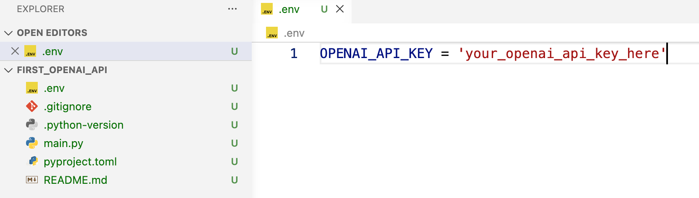
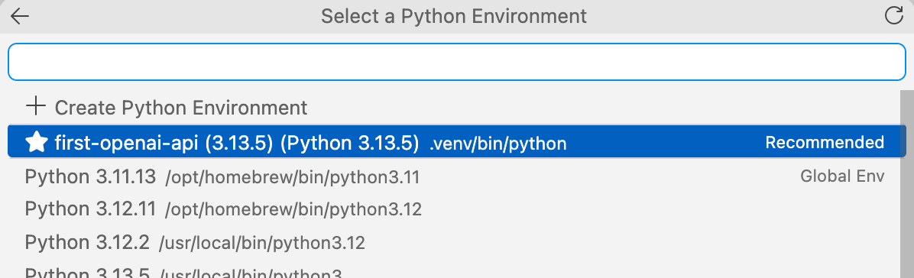

# 第一個使用 OpenAI API 的 ipynb 檔案

本教學將引導你完成以下步驟：

- 建立新的 uv 專案
- 在 .env 檔案中設定 OpenAI API 金鑰
- 建立第一個使用 OpenAI API 的 ipynb 檔案


## 使用 Python 腳本自動建置（電腦教室適用）

下載 [setup_ai_agent_course.py](setup_ai_agent_course.py)，放到可寫入的資料夾。在該資料夾開啟終端機，執行：

```bash
python setup_ai_agent_course.py
```

Windows 若使用 `py` 啟動 Python，可改成 `py setup_ai_agent_course.py`；macOS／Linux 可使用 `python3 setup_ai_agent_course.py`。啟動腳本需要 Python 3.8 以上，並需要網路連線。

腳本會檢查 uv；尚未安裝時，會下載並執行 [uv 官方安裝程式](https://docs.astral.sh/uv/getting-started/installation/)，安裝至使用者的 `.local/bin` 目錄，不需要先安裝 pip。此路徑使用官方的 [UV_INSTALL_DIR 設定](https://docs.astral.sh/uv/reference/installer/)。若學校封鎖下載或安裝程式，需由老師或管理員協助。

接著，腳本會在自己的所在資料夾旁建立 `ai_agent_course`，使用 Python 3.12 建立專案環境（必要時由 uv 下載），並安裝本講義需要的 `ipykernel`、`python-dotenv`、`langchain` 與 `langchain-openai`。

主要檔案如下：

```text
ai_agent_course/
├── .venv/
├── .env
├── .gitignore
├── .python-version
├── pyproject.toml
├── uv.lock
└── notebooks/
    └── first_openai_api.ipynb
```

若要指定其他位置，可將路徑放在指令後方，例如：

```bash
python setup_ai_agent_course.py "D:\課程練習\ai_agent_course"
```

完成後，在 VS Code 開啟產生的專案資料夾，於 `.env` 的 `OPENAI_API_KEY=""` 填入自己的金鑰。開啟 Notebook，從右上角「選取核心 → Python 環境」選擇此專案的 `.venv`；VS Code 需已安裝 Python 與 Jupyter 擴充套件。

腳本建立的是含空白程式碼儲存格的 Notebook。接著從本講義「從 .env 檔案讀取 OpenAI API 金鑰」開始加入程式碼，套件安裝指令可略過。腳本不會呼叫 OpenAI API。

重跑腳本會檢查並補齊套件，保留既有的 `.env` 與 Notebook。目標資料夾若已有其他內容且不是由此腳本建立，腳本會停止，請改用新的或空白的資料夾。若安裝後終端機找不到 `uv`，請重新開啟 VS Code／終端機。

## 建立新的 uv 專案（手動步驟）

進入你要建立 uv 專案的目錄，然後執行以下指令：

```bash
# init a new uv project named `first_openai_api`
uv init ai_agent_course
```

將 ipykernel 套件加入你的 uv 專案：

```bash
cd ai_agent_course
# add the ipykernel package to your uv project
uv add --dev ipykernel
```

在 VSCode IDE 中開啟專案資料夾。

```
code . 
```

## 在 .env 檔案中設定 OpenAI API 金鑰

在專案根目錄建立 `.env` 檔案，並在 VSCode IDE 中開啟：

```
touch .env
code .env
```

開啟 [GitHub 儲存庫](https://github.com/langchain-ai/lca-lc-foundations)中的 `.env.example` 檔案。

你應該會在 `.env.example` 檔案中看到以下內容：

```
# Third party keys
OPENAI_API_KEY = '****'
ANTHROPIC_API_KEY = '****'
GOOGLE_API_KEY = '****'
TAVILY_API_KEY = '****'

# Langsmith keys
LANGSMITH_API_KEY = '****'
LANGSMITH_TRACING=true
LANGSMITH_ENDPOINT=https://api.smith.langchain.com
LANGSMITH_PROJECT=lca-lc-foundations
```

從 `.env.example` 檔案複製 `OPENAI_API_KEY` 設定，貼到 `.env` 檔案中，並將 `****` 替換為你實際的 OpenAI API 金鑰。



## 建立 ipynb 檔案

在 `notebooks` 目錄中建立新的 Notebook 檔案 `first_openai_api.ipynb`：

```bash
cd ai_agent_course
mkdir notebooks
cd notebooks
# Create a new notebook file `first_openai_api.ipynb` in the notebooks directory
touch first_openai_api.ipynb
# Open the notebook file
code first_openai_api.ipynb
```

點選 Notebook 介面右上角的核心（Kernel）名稱，並從可用核心清單中選擇建議的核心 `first_openai_api`。



## 從 .env 檔案讀取 OpenAI API 金鑰

你可以使用 `python-dotenv` 套件，從 `.env` 檔案讀取 OpenAI API 金鑰。首先安裝此套件：

```bash
uv add python-dotenv
```

接著，在 Notebook 的第一個儲存格中加入以下程式碼，載入環境變數並讀取 OpenAI API 金鑰：

```python
import os
from dotenv import load_dotenv
# Load environment variables from the .env file
load_dotenv()
```

執行上述儲存格後，OpenAI API 金鑰就會載入環境變數中。
OpenAI API 會自動從環境變數 `OPENAI_API_KEY` 讀取 API 金鑰。

## 初始化並呼叫聊天模型

使用 `langchain.chat_models.init_chat_model` 指定模型名稱並初始化聊天模型。
接著使用 `chat_model.invoke(msg_str)`，將訊息字串傳入聊天模型以進行呼叫。

首先，前往 [OpenAI API 參考頁面](https://developers.openai.com/api/docs/models/compare)，查找你要使用的模型名稱。

最便宜的模型是 `gpt-5 nano`，每 1,000 個 tokens 的輸入費用為 0.05 美元，輸出費用為 0.4 美元。
請注意，此模型的知識截止日期為 2024 年 5 月 31 日。

接著，將所需的 langchain 與 openai 套件加入你的 uv 專案：

```bash
uv add langchain langchain-openai
```

接著，在 Notebook 的下一個儲存格中加入以下程式碼，以初始化聊天模型，並準備透過訊息字串呼叫模型：

```python
from langchain.chat_models import init_chat_model
# Initialize the chat model with the model name
chat_model = init_chat_model(model_name="gpt-5-nano")
```

新增下一個儲存格，以提示詞字串呼叫聊天模型：

```python
# Invoke the chat model with a message string
prompt_str = "Hi, please introduce yourself."
response = chat_model.invoke(prompt_str)
# Print the response from the chat model
print(response)
```

或者，使用 `pprint` 函式，以易讀的格式輸出回應：

```python
from pprint import pprint
# Pretty print the response from the chat model
pprint(response)    
```

恭喜！你已成功建立第一個使用 OpenAI API 的 ipynb 檔案。

## 關於 langchain 套件

- LangChain 提供標準的介面，以使用主要的 LLM 供應商的 API，例如 OpenAI、Anthropic、Google、Tavily 等。這些 API 供應商提供了不同的模型，具有不同的功能和特性。LangChain 將這些 API 封裝在統一的介面中，使開發者可以輕鬆地切換不同的模型，而不需要修改大量的程式碼。
- LangChain 抽象了 LLM 應用程式的核心元件, 例如: 
  - PromptTemplate: 用於生成 prompt 的模板。
  - Messages: 用於表示對話訊息的類別, 如 AIMessage, HumanMessage, SystemMessage 等。
  - ChatModel: 用於與 LLM 進行對話的模型類別。
  - Tool Calls: 用於與外部工具進行互動的呼叫。
  - Memory: 用於在對話中保持上下文的記憶。
  - Chains: 用於將多個元件組合在一起的鏈。
  - Agents: 用於自動化任務的代理程式。 

[LangChain 的快速入門及核心元件介紹](https://docs.langchain.com/oss/python/langchain/overview)
[LangChain SDK API 參考文件](https://reference.langchain.com/python/langchain)

## 關於 langchain-openai 套件

langchain-openai 是 LangChain 官方推出的獨立整合套件，專門用來連接與操作 OpenAI 的各項模型與服務。

如果要使用 groq 模型, 可使用 langchain-groq 套件, 以連接與操作 groq 的各項模型與服務。

GroqCloud 提供完全免費且不需綁定信用卡的 Free Tier（免費層）API Key。
是永久且依據速率限制（Rate Limits）重置的服務。你可以直接在免費環境下呼叫平台上的所有模型，包含 Llama 3.3、DeepSeek-R1 Distill 以及 Whisper 語音轉文字模型。

免費層的主要速率限制免費層的限制是以「組織（Organization）」為單位計算，建立多個 Key 無法加總額度。基本基準如下（各模型可能微幅調整）：每分鐘請求數 (RPM)：30 次每日請求數 (RPD)：14,400 次每分鐘 Token 數 (TPM)：約 6,000 ~ 30,000 Token（視具體模型而定）這樣的額度對於個人開發、專案原型設計（Prototyping）與測試完全綽綽有餘。

## gpt-5-nano 的費用

gpt-5-nano 是依 Token 數量計費，採 Pay-as-you-go（用多少付多少） 模式。
目前它的官方 API 價格為： [1] (https://openai.com/index/introducing-gpt-5-4-mini-and-nano/), [2] (https://explainx.ai/models/openai/gpt-5-nano/cost)

- 輸入（Input）：每 100 萬 tokens = \$0.05 美元
- 輸出（Output）：每 100 萬 tokens = \$0.40 美元
