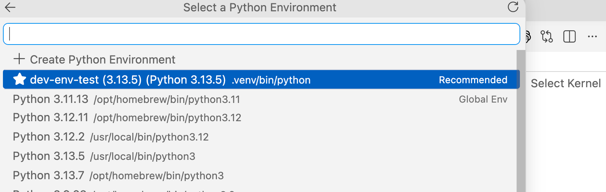
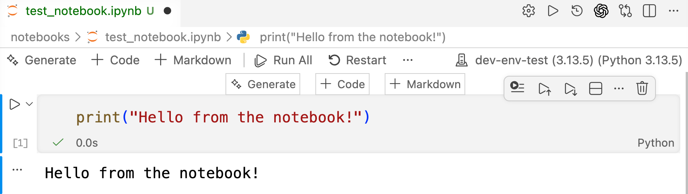

# 設定 VSCode 的 Python 開發環境

假設你已安裝：

- VSCode 整合開發環境（IDE）
- Python 版本 >=3.12、<3.14

## 在 VSCode 中安裝擴充套件

- Python 擴充套件
- Pylance 擴充套件
- Jupyter 擴充套件

## 安裝 Python 套件與專案管理工具 `uv`

前往 [uv 安裝說明](https://docs.astral.sh/uv/getting-started/installation/)頁面，依照指示在你的系統上安裝 `uv`。


## 建立新的 uv 專案

進入你的專案目錄，執行以下指令，建立名為 `dev_evn_test` 的 uv 專案：

```bash
# Navigate to your project directory
cd ai_agent_projects
# Create a new uv project with the directory name `dev_evn_test`
uv init dev_evn_test
```

上述指令會建立 `ai_agent_projects/dev_evn_test` 目錄，並在其中初始化新的 uv 專案。

專案包含 pyproject.toml、範例檔案（main.py）、README 說明文件，以及指定 Python 版本的檔案（.python-version）。

- 執行 `tree dev_env_test` 查看專案結構：

```
dev_env_test
├── README.md
├── main.py
└── pyproject.toml
```

## 測試 uv 專案

進入專案目錄，執行以下指令來測試 uv 專案：

```bash
cd dev_evn_test
uv run main.py
``` 

原理：

- uv 會為專案建立虛擬環境，並安裝 pyproject.toml 檔案中指定的相依套件。
- 你無法直接使用 `python main.py` 執行 main.py 檔案，因為相依套件安裝在 uv 建立的虛擬環境中。
- 你必須在虛擬環境中執行 Python 檔案。
- 使用 `uv run main.py` 執行 main.py 檔案。

```
uv run main.py 
Using CPython 3.13.5 interpreter at: /usr/local/bin/python3.13
Creating virtual environment at: .venv
Hello from dev-env-test!
```

## 在 uv 專案中建立 Python Notebook

在 uv 專案中建立 `notebooks` 目錄，並在其中建立新的 Notebook 檔案 `test_notebook.ipynb`。

```bash
cd dev_evn_test
mkdir notebooks
cd notebooks
# Create a new notebook file `test_notebook.ipynb` in the notebooks directory
touch test_notebook.ipynb
# Open the notebook file
code test_notebook.ipynb
```

## 選擇 Notebook 的 Python 直譯器

在 uv 專案的虛擬環境中安裝 ipykernel 套件：

```bash
uv add --dev ipykernel
```

- `--dev` 選項會將套件安裝為開發相依套件，表示該套件會安裝在 uv 建立的虛擬環境中，但不會列入正式環境的相依套件。

重新啟動 VSCode IDE（僅需在首次安裝 ipykernel 套件後執行）。


接著選擇 Notebook 的核心（Kernel）：

- 點選 Notebook 介面右上角的核心名稱。
- 從可用核心清單中選擇建議的核心 `dev-env-test`。



## 在 Notebook 中建立並執行第一個儲存格

- 在 Notebook 中建立新的儲存格，並輸入以下程式碼：


```python
print("Hello from the notebook!")
```



恭喜！你已完成 VSCode 的 Python 開發環境設定，並建立包含 Python Notebook 的 uv 專案。現在可以開始在此環境中開發 AI Agent 專案。


